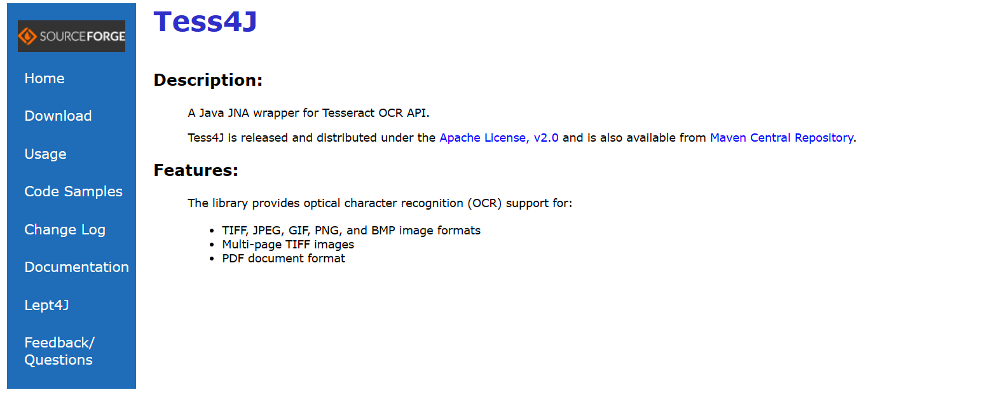
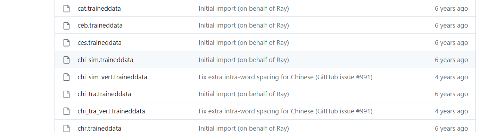

[toc]


# 概述

OCR字符识别是指电子设备（例如扫描仪或数码相机）检查纸上打印的字符，然后用字符识别方法将形状翻译成计算机文字的过程；即，对文本资料进行扫描，然后对图像文件进行分析处理，获取文字及版面信息的过程。如何除错或利用辅助信息提高识别正确率


# OCR引擎

## Tesseract

### 概述

Tesseract 是谷歌开发并开源的图像文字识别引擎，使用python开发。


### 优点

1. github上面star非常多，项目非常活跃
2. 识别的语言和文字非常多
3. 公司非常强（google）


### 劣势

1. 不是专门针对中文场景
2.  相关文档主要是英文，对于阅读和理解起来有一定困难
3. 学习成本比较高
4. 源码较多，并且部分源码是c++，学习起来难度比较大


## PaddleOCR

### 概述

PaddleOCR 是百度开源的中文识别的ocr开源软件


### 优势

1. github上面star非常多，项目非常活跃
2. 模型只针对中文进行训练
3. 公司非常强（baidu）
4. 相关的中文文档非常齐全
5. 识别的精确度比较高


### 劣势

1. 目前使用的训练模型是基于百度公司自己的PaddlePaddle框架，对于小公司来说并不主流（对比于ts或者pytorch），所使用深度学习框架为后续其他深度学习无法做很好的铺垫
2. 项目整体比较复杂，学习成本较高


## EasyOCR

### 概述

EasyOCR 是一个用 Python 编写的 OCR 库，用于识别图像中的文字并输出为文本，支持 80 多种语言。


### 优点

1. github上面的star也是比较多，但是最近不是特别活跃
2. 支持的语言也是非常多，多达80多种
3. 识别的精确度尚可


### 劣势

1. 从官方的页面体验来说识别的速度较慢
2. 识别的文字种类多，学习难度较高
3. 相关的官方文档是基于英文的，学习难度较高，对于新手不太友好


## chineseocr

### 优点

1. github上面的star也是比较多
2. 专门针对中文进行学习和训练的模型
3. 相关的文档比较多，上手相对比较容易


### 劣势

1. 存在一些bug
2. 对于复杂场景下的效果不佳
3. 模型都是现成的，如果要新训练模型难度比较高


## chineseocr_lite

### 优点

1. github上面的star也是比较多
2. 专门针对中文进行学习和训练的模型
3. 相关的文档比较多，上手相对比较容易
4. 比较轻量级，部署也比较方便


### 劣势

未知


## TrWebOCR

### 优点

1. 部署简单
2. 使用简单
3. 有对应的web页面，测试方便
4. 有对应的web接口，方便调用


### 劣势

1. 核心模型不开源，无法进行再次学习
2. 无法进行后续训练
3. 必须要联网才能使用
4. 精度识别一般
5. 项目不是很活跃


## cnocr

### 优点

1. 使用简单
2. 文档齐全
3. 代码全部开源，可以进行修改
4. 预定义的模型较多
5. 便于学习和模型重新训练


### 劣势

1. 精确度不高
2. 没有对应的web界面和接口
3. 需要配合cnstd进行使用


# Tess4j

## 概述

Tess4J是对Tesseract OCR API 的Java JNA 封装。使 java 能够通过调用 Tess4J 的 API 来使用 Tesseract OCR。支持的格式包括 TIFF、JPEG、GIF、PNG、BMP、JPEG、PDF。Tess4J是 java 直接可使用的 jar 包，而 Tesseract OCR 是支持 Tess4J 进文件文字识别的基础，Tess4J 可直接使用 Maven 方式引入


注意：

* **Tesseract是一个开源的光学字符识别（OCR）引擎**，它可以将图像中的文字转换为计算机可读的文本。支持多种语言和书面语言，并且可以在命令行中执行。它是一个流行的开源OCR工具，可以在许多不同的操作系统上运行。
* **Tess4J是一个基于Tesseract OCR引擎的Java接口**，可以用来识别图像中的文本，说白了，就是封装了它的API，让Java可以直接调用。


## 官网

https://tess4j.sourceforge.net





## Maven仓库

https://mvnrepository.com/artifact/net.sourceforge.tess4j/tess4j


## 下载语言模型

tesseract 支持一百多种语言识别，你可以从 [Traineddata 语言模型说明下载页面](https://github.com/tesseract-ocr/tessdoc/blob/main/Data-Files.md#data-files-for-version-400-november-29-2016) 选择自己想要识别的`.traineddata `格式的语言模型文件下载。


- 如果你想识别图片里的各种方向的文字可以下载 [osd.traineddata 模型](https://github.com/tesseract-ocr/tessdata/raw/3.04.00/osd.traineddata)
- 如果你想识别图片里的各种数学公式、方程可以下载 [equ.traineddata 模型](https://github.com/tesseract-ocr/tessdata/raw/3.04.00/equ.traineddata)


tesseract 在 GitHub 上的有三个独立的语言模型存储库 [tessdata](https://github.com/tesseract-ocr/tessdata)、[tessdata-best](https://github.com/tesseract-ocr/tessdata_best)、[tessdata-fast ](https://github.com/tesseract-ocr/tessdata_fast)他们分别都存储了语言模型，他们的区别是：


| 独立的语言模型存储库 | 如何训练得到的                   | 速度                  | 识别准确性                  | 是否支持旧版 | 是否支持再训练 |
| :---------------------------------------------------: | :------------------------------: | :-------------------: | :-------------------------: | :----------: | :------------: |
| [tessdata](https://github.com/tesseract-ocr/tessdata) | 传统+LSTM（并整合tessdata-best） | 比 tessdata-best 更快 | 比 tessdata-best 准确度稍低 | 支持         | 不支持         |
| [tessdata-best](https://github.com/tesseract-ocr/tessdata_best) | 仅 LSTM（基于[langdata](https://github.com/tesseract-ocr/langdata)） | 最慢   | 最准确   | 不支持 | 支持   |
| [tessdata-fast](https://github.com/tesseract-ocr/tessdata_fast) | 比 tessdata-best 更小的 LSTM网络整合                         | 最快的 | 最不准确 | 不支持 | 不支持 |


下载对应语言的tessdata文件：

* chi_sim.traineddata：简体中文模型
* eng.traineddata：英文模型





## 使用

新建一个spring boot项目，名字为`spring-boot-Tess4J-ocr`


pom文件如下：

```xml
<?xml version="1.0" encoding="UTF-8"?>
<project xmlns="http://maven.apache.org/POM/4.0.0" xmlns:xsi="http://www.w3.org/2001/XMLSchema-instance"
         xsi:schemaLocation="http://maven.apache.org/POM/4.0.0 https://maven.apache.org/xsd/maven-4.0.0.xsd">
    <modelVersion>4.0.0</modelVersion>
    <parent>
        <groupId>org.springframework.boot</groupId>
        <artifactId>spring-boot-starter-parent</artifactId>
        <version>2.7.1</version>
        <relativePath/> <!-- lookup parent from repository -->
    </parent>
    <groupId>mao</groupId>
    <artifactId>spring-boot-Tess4J-ocr</artifactId>
    <version>0.0.1-SNAPSHOT</version>
    <name>spring-boot-Tess4J-ocr</name>
    <description>spring-boot-Tess4J-ocr</description>
    <properties>
        <java.version>17</java.version>
    </properties>
    <dependencies>
        <dependency>
            <groupId>org.springframework.boot</groupId>
            <artifactId>spring-boot-starter-web</artifactId>
        </dependency>

        <dependency>
            <groupId>org.springframework.boot</groupId>
            <artifactId>spring-boot-starter-test</artifactId>
            <scope>test</scope>
        </dependency>

        <dependency>
            <groupId>net.sourceforge.tess4j</groupId>
            <artifactId>tess4j</artifactId>
            <version>5.7.0</version>
        </dependency>

        <!--lombok-->
        <dependency>
            <groupId>org.projectlombok</groupId>
            <artifactId>lombok</artifactId>
            <version>1.18.20</version>
        </dependency>
    </dependencies>

    <build>
        <plugins>
            <plugin>
                <groupId>org.springframework.boot</groupId>
                <artifactId>spring-boot-maven-plugin</artifactId>
            </plugin>
        </plugins>
    </build>

</project>
```


