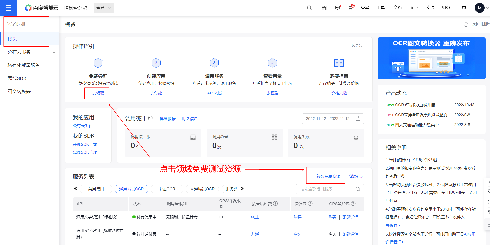
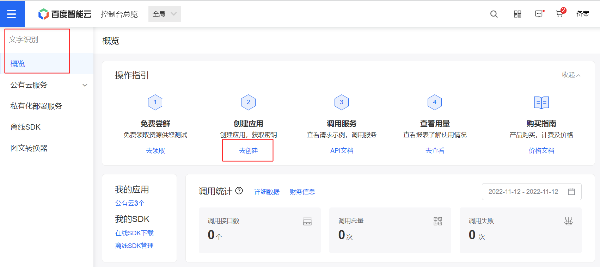
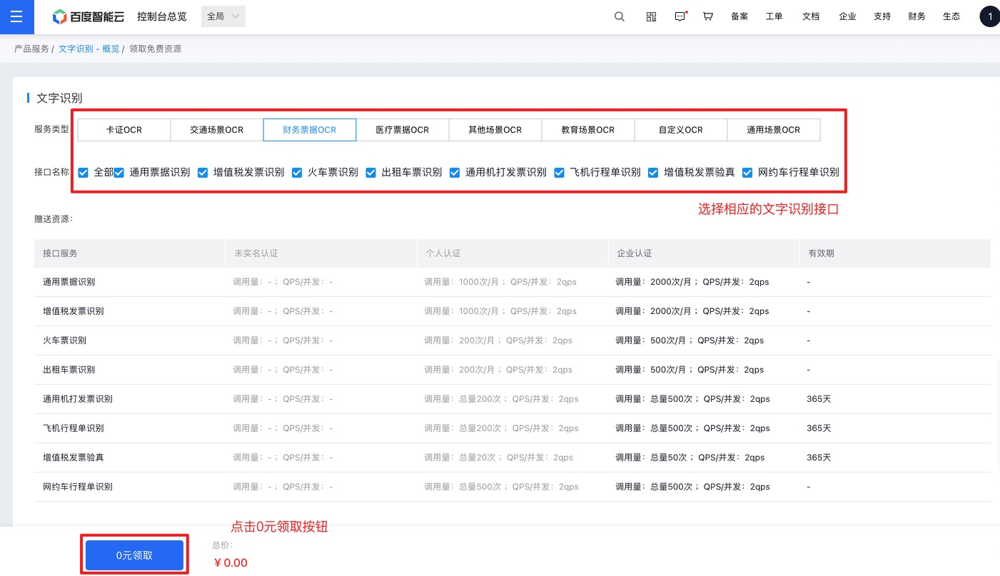

<h1 style="font-size:3.3em;color:skyblue;text-align:center">ocr学习笔记</h1>

[toc]

---


# 概述

OCR字符识别是指电子设备（例如扫描仪或数码相机）检查纸上打印的字符，然后用字符识别方法将形状翻译成计算机文字的过程；即，对文本资料进行扫描，然后对图像文件进行分析处理，获取文字及版面信息的过程。如何除错或利用辅助信息提高识别正确率


# OCR引擎

## Tesseract

### 概述

Tesseract 是谷歌开发并开源的图像文字识别引擎，使用python开发。


### 优点

1. github上面star非常多，项目非常活跃
2. 识别的语言和文字非常多
3. 公司非常强（google）


### 劣势

1. 不是专门针对中文场景
2.  相关文档主要是英文，对于阅读和理解起来有一定困难
3. 学习成本比较高
4. 源码较多，并且部分源码是c++，学习起来难度比较大


## PaddleOCR

### 概述

PaddleOCR 是百度开源的中文识别的ocr开源软件


### 优势

1. github上面star非常多，项目非常活跃
2. 模型只针对中文进行训练
3. 公司非常强（baidu）
4. 相关的中文文档非常齐全
5. 识别的精确度比较高


### 劣势

1. 目前使用的训练模型是基于百度公司自己的PaddlePaddle框架，对于小公司来说并不主流（对比于ts或者pytorch），所使用深度学习框架为后续其他深度学习无法做很好的铺垫
2. 项目整体比较复杂，学习成本较高


## EasyOCR

### 概述

EasyOCR 是一个用 Python 编写的 OCR 库，用于识别图像中的文字并输出为文本，支持 80 多种语言。


### 优点

1. github上面的star也是比较多，但是最近不是特别活跃
2. 支持的语言也是非常多，多达80多种
3. 识别的精确度尚可


### 劣势

1. 从官方的页面体验来说识别的速度较慢
2. 识别的文字种类多，学习难度较高
3. 相关的官方文档是基于英文的，学习难度较高，对于新手不太友好


## chineseocr

### 优点

1. github上面的star也是比较多
2. 专门针对中文进行学习和训练的模型
3. 相关的文档比较多，上手相对比较容易


### 劣势

1. 存在一些bug
2. 对于复杂场景下的效果不佳
3. 模型都是现成的，如果要新训练模型难度比较高


## chineseocr_lite

### 优点

1. github上面的star也是比较多
2. 专门针对中文进行学习和训练的模型
3. 相关的文档比较多，上手相对比较容易
4. 比较轻量级，部署也比较方便


### 劣势

未知


## TrWebOCR

### 优点

1. 部署简单
2. 使用简单
3. 有对应的web页面，测试方便
4. 有对应的web接口，方便调用


### 劣势

1. 核心模型不开源，无法进行再次学习
2. 无法进行后续训练
3. 必须要联网才能使用
4. 精度识别一般
5. 项目不是很活跃


## cnocr

### 优点

1. 使用简单
2. 文档齐全
3. 代码全部开源，可以进行修改
4. 预定义的模型较多
5. 便于学习和模型重新训练


### 劣势

1. 精确度不高
2. 没有对应的web界面和接口
3. 需要配合cnstd进行使用


# Tess4j

## 概述

Tess4J是对Tesseract OCR API 的Java JNA 封装。使 java 能够通过调用 Tess4J 的 API 来使用 Tesseract OCR。支持的格式包括 TIFF、JPEG、GIF、PNG、BMP、JPEG、PDF。Tess4J是 java 直接可使用的 jar 包，而 Tesseract OCR 是支持 Tess4J 进文件文字识别的基础，Tess4J 可直接使用 Maven 方式引入


注意：

* **Tesseract是一个开源的光学字符识别（OCR）引擎**，它可以将图像中的文字转换为计算机可读的文本。支持多种语言和书面语言，并且可以在命令行中执行。它是一个流行的开源OCR工具，可以在许多不同的操作系统上运行。
* **Tess4J是一个基于Tesseract OCR引擎的Java接口**，可以用来识别图像中的文本，说白了，就是封装了它的API，让Java可以直接调用。


## 官网

https://tess4j.sourceforge.net


## Maven仓库

https://mvnrepository.com/artifact/net.sourceforge.tess4j/tess4j


## 下载语言模型

tesseract 支持一百多种语言识别，你可以从 [Traineddata 语言模型说明下载页面](https://github.com/tesseract-ocr/tessdoc/blob/main/Data-Files.md#data-files-for-version-400-november-29-2016) 选择自己想要识别的`.traineddata `格式的语言模型文件下载。


- 如果你想识别图片里的各种方向的文字可以下载 [osd.traineddata 模型](https://github.com/tesseract-ocr/tessdata/raw/3.04.00/osd.traineddata)
- 如果你想识别图片里的各种数学公式、方程可以下载 [equ.traineddata 模型](https://github.com/tesseract-ocr/tessdata/raw/3.04.00/equ.traineddata)


tesseract 在 GitHub 上的有三个独立的语言模型存储库 [tessdata](https://github.com/tesseract-ocr/tessdata)、[tessdata-best](https://github.com/tesseract-ocr/tessdata_best)、[tessdata-fast ](https://github.com/tesseract-ocr/tessdata_fast)他们分别都存储了语言模型，他们的区别是：


| 独立的语言模型存储库 | 如何训练得到的                   | 速度                  | 识别准确性                  | 是否支持旧版 | 是否支持再训练 |
| :---------------------------------------------------: | :------------------------------: | :-------------------: | :-------------------------: | :----------: | :------------: |
| [tessdata](https://github.com/tesseract-ocr/tessdata) | 传统+LSTM（并整合tessdata-best） | 比 tessdata-best 更快 | 比 tessdata-best 准确度稍低 | 支持         | 不支持         |
| [tessdata-best](https://github.com/tesseract-ocr/tessdata_best) | 仅 LSTM（基于[langdata](https://github.com/tesseract-ocr/langdata)） | 最慢   | 最准确   | 不支持 | 支持   |
| [tessdata-fast](https://github.com/tesseract-ocr/tessdata_fast) | 比 tessdata-best 更小的 LSTM网络整合                         | 最快的 | 最不准确 | 不支持 | 不支持 |


下载对应语言的tessdata文件：

* chi_sim.traineddata：简体中文模型
* eng.traineddata：英文模型


## 使用

新建一个spring boot项目，名字为`spring-boot-Tess4J-ocr`


### 编写pom文件

pom文件如下：

```xml
<?xml version="1.0" encoding="UTF-8"?>
<project xmlns="http://maven.apache.org/POM/4.0.0" xmlns:xsi="http://www.w3.org/2001/XMLSchema-instance"
         xsi:schemaLocation="http://maven.apache.org/POM/4.0.0 https://maven.apache.org/xsd/maven-4.0.0.xsd">
    <modelVersion>4.0.0</modelVersion>
    <parent>
        <groupId>org.springframework.boot</groupId>
        <artifactId>spring-boot-starter-parent</artifactId>
        <version>2.7.1</version>
        <relativePath/> <!-- lookup parent from repository -->
    </parent>
    <groupId>mao</groupId>
    <artifactId>spring-boot-Tess4J-ocr</artifactId>
    <version>0.0.1-SNAPSHOT</version>
    <name>spring-boot-Tess4J-ocr</name>
    <description>spring-boot-Tess4J-ocr</description>
    <properties>
        <java.version>17</java.version>
    </properties>
    <dependencies>
        <dependency>
            <groupId>org.springframework.boot</groupId>
            <artifactId>spring-boot-starter-web</artifactId>
        </dependency>

        <dependency>
            <groupId>org.springframework.boot</groupId>
            <artifactId>spring-boot-starter-test</artifactId>
            <scope>test</scope>
        </dependency>

        <dependency>
            <groupId>net.sourceforge.tess4j</groupId>
            <artifactId>tess4j</artifactId>
            <version>5.7.0</version>
        </dependency>

        <!--lombok-->
        <dependency>
            <groupId>org.projectlombok</groupId>
            <artifactId>lombok</artifactId>
            <version>1.18.20</version>
        </dependency>
    </dependencies>

    <build>
        <plugins>
            <plugin>
                <groupId>org.springframework.boot</groupId>
                <artifactId>spring-boot-maven-plugin</artifactId>
            </plugin>
        </plugins>
    </build>

</project>
```


### 编写application.yml

```yml
server:
  port: 9091

# 训练数据文件夹的路径
tess4j:
  datapath: './tessdata'
```


### 基本使用

在photos目录下放3张图片，名字分别为test1.jpg、test2.jpg和test3.jpg


test1.jpg

test2.jpg


test3.jpg


编写单元测试：

```java
package mao.springboottess4jocr;

import net.sourceforge.tess4j.Tesseract;
import net.sourceforge.tess4j.TesseractException;
import org.junit.jupiter.api.Test;
import org.springframework.beans.factory.annotation.Value;
import org.springframework.boot.test.context.SpringBootTest;

import java.io.File;

@SpringBootTest
class SpringBootTess4JOcrApplicationTests
{
    @Value("${tess4j.datapath}")
    private String dataPath;


    @Test
    void contextLoads()
    {
    }

    @Test
    void test() throws TesseractException
    {
        long start = System.currentTimeMillis();
        System.out.println("开始OCR文字识图，请稍后...");
        //加载要识别的图片
        File image = new File("./photos/test1.jpg");
        //设置配置文件夹微视、识别语言、识别模式
        Tesseract tesseract = new Tesseract();
        tesseract.setDatapath(dataPath);
        //设置识别语言为中文简体，（如果要设置为英文可改为"eng"）
        tesseract.setLanguage("chi_sim");
        //使用 OSD 进行自动页面分割以进行图像处理
        tesseract.setPageSegMode(1);
        //设置引擎模式是神经网络LSTM引擎
        tesseract.setOcrEngineMode(1);
        //开始识别整张图片中的文字
        String result = tesseract.doOCR(image);
        long time = System.currentTimeMillis() - start;
        System.out.println("识别结束,耗时：" + time + " 毫秒，识别结果如下：");
        System.out.println();
        System.out.println(result.replaceAll(" ",""));
        result = tesseract.doOCR(new File("./photos/test2.jpg"));
        System.out.println();
        System.out.println(result.replaceAll(" ",""));
        result = tesseract.doOCR(new File("./photos/test3.jpg"));
        System.out.println();
        System.out.println(result.replaceAll(" ",""));
    }

}
```


```sh
开始OCR文字识图，请稍后...
Estimating resolution as 264
识别结束,耗时：3437 毫秒，识别结果如下：

微基准测试套件

概述

JMH,，即javaMicrobenchmarkHarness，是专门用于代码微基准测试的工具套件。何谓MicroBenchmark呢?简单的来说就是基于方法层面的基准测试，精度
可以达到微秒级。当你希望进一步优化方法执行性能的时候，就可以使用MH对优化的结果进行量化的分析

此功能为DK源代码添加了一套微基准测试套件，简化了现有微基准测试的运行和新基准测试的创建过程

使开发人员可以轻松运行现有的微基准测试并创建新的基准测试，其目标在于提供一个稳定目优化过的基准。它基于javaMicrobenchmarkHarnessUMH)，
可以轻松测试|DK性能，支持IMH更新

应用场景

。想定量地知道某个方法需要执行多长时间，以及执行时间和输入n的相关性
。一个接口有两种不同实现(例如实现A使用了FixedThreadPool，实现B使用了ForkjoinPool)，不知道哪种实现性能更好


Estimating resolution as 165

am上wwN

<dependency>
<groupId>net.sourceforge.tess4j</groupId>
<artifactId>tess4j</artifactId>
<versiony4.5.4</version>

</dependency>

Estimating resolution as 218
OSD: Weak margin (3.50) for 92 blob text block, but using orientation anyway: 0

cloudadmin管理员云系统管理员，不可删除工作卓面医废超级角色
clouddefautt操作员云乏统缺省角色，不可删除工作看面医度缺洛角色
manager公司领导仪表指数医废

prop_admin工作看面医度岗位角色
```


耗时5.8秒，不一定准确


### 编写TesseractOcrConfiguration

```java
package mao.springboottess4jocr.config;

import lombok.SneakyThrows;
import lombok.extern.slf4j.Slf4j;
import net.sourceforge.tess4j.Tesseract;
import org.slf4j.Logger;
import org.slf4j.LoggerFactory;
import org.springframework.beans.factory.annotation.Value;
import org.springframework.context.annotation.Bean;
import org.springframework.context.annotation.Configuration;
import org.springframework.context.annotation.Lazy;

import javax.annotation.PostConstruct;

/**
 * Project name(项目名称)：spring-boot-Tess4J-ocr
 * Package(包名): mao.springboottess4jocr.config
 * Class(类名): TesseractOcrConfiguration
 * Author(作者）: mao
 * Author QQ：1296193245
 * GitHub：https://github.com/maomao124/
 * Date(创建日期)： 2023/11/7
 * Time(创建时间)： 17:09
 * Version(版本): 1.0
 * Description(描述)： 无
 */

@Slf4j
@Configuration
public class TesseractOcrConfiguration
{
    @Value("${tess4j.datapath}")
    private String dataPath;


    @SneakyThrows
    @Bean
    public Tesseract ocrTesseract()
    {
        Tesseract tesseract = new Tesseract();
        //设置训练数据文件夹路径
        tesseract.setDatapath(dataPath);
        //设置识别语言为中文简体，（如果要设置为英文可改为"eng"）
        tesseract.setLanguage("chi_sim");
        //使用 OSD 进行自动页面分割以进行图像处理
        tesseract.setPageSegMode(1);
        //设置引擎模式是神经网络LSTM引擎
        tesseract.setOcrEngineMode(1);
        log.info("初始化Tesseract");
        return tesseract;
    }

    @PostConstruct
    public void init()
    {
        log.info("初始化 TesseractOcrConfiguration ，dataPath：" + dataPath);
    }
}
```


### 编写OcrService

```java
package mao.springboottess4jocr.service;

import org.springframework.web.multipart.MultipartFile;

import java.io.File;

/**
 * Project name(项目名称)：spring-boot-Tess4J-ocr
 * Package(包名): mao.springboottess4jocr.service
 * Interface(接口名): OcrService
 * Author(作者）: mao
 * Author QQ：1296193245
 * GitHub：https://github.com/maomao124/
 * Date(创建日期)： 2023/11/7
 * Time(创建时间)： 17:06
 * Version(版本): 1.0
 * Description(描述)： 文字识别服务
 */

public interface OcrService
{
    /**
     * 识别图像的文本，不支持并发
     *
     * @param imageFile 图像文件
     * @return {@link String} 识别后的文字
     */
    String recognizeText(MultipartFile imageFile);

    /**
     * 识别图像的文本，不支持并发
     *
     * @param imageFile 图像文件
     * @return {@link String} 识别后的文字
     */
    String recognizeText(File imageFile);

    /**
     * 识别图像的文本，支持并发
     *
     * @param imageFile 图像文件
     * @return {@link String} 识别后的文字
     */
    String recognizeTextConcurrency(MultipartFile imageFile);

    /**
     * 识别图像的文本，支持并发
     *
     * @param imageFile 图像文件
     * @return {@link String} 识别后的文字
     */
    String recognizeTextConcurrency(File imageFile);


    /**
     * 识别图像的文本，支持并发
     *
     * @param imageFile 图像文件
     * @param language  语言
     * @return {@link String} 识别后的文字
     */
    String recognizeTextConcurrency(MultipartFile imageFile, String language);

    /**
     * 识别图像的文本，支持并发
     *
     * @param imageFile 图像文件
     * @param language  语言
     * @return {@link String} 识别后的文字
     */
    String recognizeTextConcurrency(File imageFile, String language);
}
```


### 编写OcrServiceImpl

```java
package mao.springboottess4jocr.service.impl;

import lombok.SneakyThrows;
import mao.springboottess4jocr.service.OcrService;
import net.sourceforge.tess4j.Tesseract;
import org.springframework.beans.factory.annotation.Autowired;
import org.springframework.beans.factory.annotation.Value;
import org.springframework.stereotype.Service;
import org.springframework.web.multipart.MultipartFile;

import javax.annotation.Resource;
import javax.imageio.ImageIO;
import java.awt.image.BufferedImage;
import java.io.ByteArrayInputStream;
import java.io.File;
import java.io.InputStream;

/**
 * Project name(项目名称)：spring-boot-Tess4J-ocr
 * Package(包名): mao.springboottess4jocr.service.impl
 * Class(类名): OcrServiceImpl
 * Author(作者）: mao
 * Author QQ：1296193245
 * GitHub：https://github.com/maomao124/
 * Date(创建日期)： 2023/11/7
 * Time(创建时间)： 17:08
 * Version(版本): 1.0
 * Description(描述)： 文字识别服务实现
 */

@Service
public class OcrServiceImpl implements OcrService
{

    @Resource(name = "ocrTesseract")
    private Tesseract ocrTesseract;

    @Value("${tess4j.datapath}")
    private String dataPath;

    @SneakyThrows
    @Override
    public synchronized String recognizeText(MultipartFile imageFile)
    {
        //转换
        InputStream inputStream = new ByteArrayInputStream(imageFile.getBytes());
        BufferedImage bufferedImage = ImageIO.read(inputStream);
        //对图片进行文字识别
        String result = ocrTesseract.doOCR(bufferedImage);
        if (result != null)
        {
            result = result.replaceAll(" ", "");
        }
        return result;
    }

    @SneakyThrows
    @Override
    public synchronized String recognizeText(File imageFile)
    {
        //对图片进行文字识别
        String result = ocrTesseract.doOCR(imageFile);
        if (result != null)
        {
            result = result.replaceAll(" ", "");
        }
        return result;
    }

    @SneakyThrows
    @Override
    public String recognizeTextConcurrency(MultipartFile imageFile)
    {
        return recognizeTextConcurrency(imageFile, "chi_sim");
    }


    @SneakyThrows
    @Override
    public String recognizeTextConcurrency(File imageFile)
    {
        return recognizeTextConcurrency(imageFile, "chi_sim");
    }

    @SneakyThrows
    @Override
    public String recognizeTextConcurrency(MultipartFile imageFile, String language)
    {
        Tesseract tesseract = new Tesseract();
        //设置训练数据文件夹路径
        tesseract.setDatapath(dataPath);
        //设置识别语言为中文简体，（如果要设置为英文可改为"eng"）
        tesseract.setLanguage(language);
        //使用 OSD 进行自动页面分割以进行图像处理
        tesseract.setPageSegMode(1);
        //设置引擎模式是神经网络LSTM引擎
        tesseract.setOcrEngineMode(1);
        //对图片进行文字识别
        InputStream inputStream = new ByteArrayInputStream(imageFile.getBytes());
        BufferedImage bufferedImage = ImageIO.read(inputStream);
        //对图片进行文字识别
        String result = ocrTesseract.doOCR(bufferedImage);
        if (result != null)
        {
            result = result.replaceAll(" ", "");
        }
        return result;
    }

    @SneakyThrows
    @Override
    public String recognizeTextConcurrency(File imageFile, String language)
    {
        Tesseract tesseract = new Tesseract();
        //设置训练数据文件夹路径
        tesseract.setDatapath(dataPath);
        //设置识别语言为中文简体，（如果要设置为英文可改为"eng"）
        tesseract.setLanguage(language);
        //使用 OSD 进行自动页面分割以进行图像处理
        tesseract.setPageSegMode(1);
        //设置引擎模式是神经网络LSTM引擎
        tesseract.setOcrEngineMode(1);
        //对图片进行文字识别
        String result = tesseract.doOCR(imageFile);
        if (result != null)
        {
            result = result.replaceAll(" ", "");
        }
        return result;
    }
}
```


### 编写单元测试OcrServiceImplTest

```java
package mao.springboottess4jocr.service.impl;

import lombok.SneakyThrows;
import net.sourceforge.tess4j.Tesseract;
import net.sourceforge.tess4j.TesseractException;
import org.junit.jupiter.api.Test;
import org.springframework.beans.factory.annotation.Autowired;
import org.springframework.boot.test.context.SpringBootTest;
import org.springframework.boot.test.mock.mockito.MockBean;

import java.io.File;
import java.nio.file.Paths;
import java.util.concurrent.CountDownLatch;

import static org.junit.jupiter.api.Assertions.assertEquals;
import static org.mockito.Mockito.any;
import static org.mockito.Mockito.verify;
import static org.mockito.Mockito.when;


@SpringBootTest
class OcrServiceImplTest
{
    @Autowired
    private OcrServiceImpl ocrServiceImpl;


    @SneakyThrows
    @Test
    void testRecognizeText1() throws TesseractException
    {
        System.out.println(ocrServiceImpl.recognizeText(new File("./photos/test1.jpg")));
    }

    @Test
    void testRecognizeText2() throws TesseractException
    {
        System.out.println(ocrServiceImpl.recognizeText(new File("./photos/test2.jpg")));
    }

    @Test
    void testRecognizeText3() throws TesseractException
    {
        System.out.println(ocrServiceImpl.recognizeText(new File("./photos/test3.jpg")));
    }

    @Test
    void testRecognizeText4() throws TesseractException
    {
        System.out.println(ocrServiceImpl.recognizeText(new File("./photos/test4.jpg")));
    }

    @Test
    void testRecognizeText5() throws TesseractException
    {
        System.out.println(ocrServiceImpl.recognizeText(new File("./photos/test5.jpg")));
    }

    @Test
    void testRecognizeText6() throws TesseractException
    {
        System.out.println(ocrServiceImpl.recognizeText(new File("./photos/test6.jpg")));
    }

    @Test
    void testRecognizeText7() throws TesseractException
    {
        System.out.println(ocrServiceImpl.recognizeText(new File("./photos/test7.jpg")));
    }

    @Test
    void testRecognizeText8() throws TesseractException
    {
        System.out.println(ocrServiceImpl.recognizeText(new File("./photos/test8.jpg")));
    }

    @Test
    void testRecognizeText9() throws TesseractException
    {
        System.out.println(ocrServiceImpl.recognizeText(new File("./photos/test9.jpg")));
    }

    @Test
    void testRecognizeText10() throws TesseractException
    {
        System.out.println(ocrServiceImpl.recognizeText(new File("./photos/test10.jpg")));
    }

    @Test
    void testRecognizeText11() throws TesseractException
    {
        System.out.println(ocrServiceImpl.recognizeText(new File("./photos/test11.jpg")));
    }

    @Test
    void testRecognizeText12() throws TesseractException
    {
        System.out.println(ocrServiceImpl.recognizeText(new File("./photos/test12.jpg")));
    }

    @Test
    void testRecognizeText13() throws TesseractException
    {
        System.out.println(ocrServiceImpl.recognizeText(new File("./photos/test13.jpg")));
    }

    @Test
    void testRecognizeText14() throws TesseractException
    {
        System.out.println(ocrServiceImpl.recognizeText(new File("./photos/test14.jpg")));
    }

    @Test
    void testRecognizeText15() throws TesseractException
    {
        System.out.println(ocrServiceImpl.recognizeText(new File("./photos/test15.jpg")));
    }

    @Test
    void testRecognizeText16() throws TesseractException
    {
        System.out.println(ocrServiceImpl.recognizeText(new File("./photos/test16.jpg")));
    }

    @SneakyThrows
    @Test
    void testRecognizeTextConcurrency1() throws TesseractException
    {
        //ocrServiceImpl.recognizeText(new File("./photos/test1.jpg"));
        CountDownLatch countDownLatch = new CountDownLatch(32);
        for (int i = 0; i < 32; i++)
        {
            new Thread(new Runnable()
            {
                @Override
                public void run()
                {
                    String s = ocrServiceImpl.recognizeText(new File("./photos/test1.jpg"));
                    System.out.println(s);
                    countDownLatch.countDown();
                }
            }).start();
        }
        countDownLatch.await();
    }

    @SneakyThrows
    @Test
    void testRecognizeTextConcurrency2() throws TesseractException
    {
        //ocrServiceImpl.recognizeText(new File("./photos/test1.jpg"));
        CountDownLatch countDownLatch = new CountDownLatch(16);
        for (int i = 0; i < 16; i++)
        {
            int finalI = i;
            new Thread(new Runnable()
            {
                @Override
                public void run()
                {
                    String s = ocrServiceImpl.recognizeText(new File("./photos/test" + (finalI + 1) + ".jpg"));
                    System.out.println(s);
                    countDownLatch.countDown();
                }
            }).start();
        }
        countDownLatch.await();
    }

    @SneakyThrows
    @Test
    void testRecognizeTextConcurrency3() throws TesseractException
    {
        //ocrServiceImpl.recognizeText(new File("./photos/test1.jpg"));
        CountDownLatch countDownLatch = new CountDownLatch(16);
        for (int i = 0; i < 16; i++)
        {
            int finalI = i;
            new Thread(new Runnable()
            {
                @Override
                public void run()
                {
                    String s = ocrServiceImpl.recognizeTextConcurrency(new File("./photos/test" + (finalI + 1) + ".jpg"));
                    System.out.println(s);
                    countDownLatch.countDown();
                }
            }).start();
        }
        countDownLatch.await();
    }

    @SneakyThrows
    @Test
    void testRecognizeTextConcurrency4() throws TesseractException
    {
        //ocrServiceImpl.recognizeText(new File("./photos/test1.jpg"));
        CountDownLatch countDownLatch = new CountDownLatch(16);
        for (int i = 0; i < 16; i++)
        {
            int finalI = i;
            new Thread(new Runnable()
            {
                @Override
                public void run()
                {
                    String s = ocrServiceImpl.recognizeTextConcurrency(new File("./photos/test1.jpg"));
                    System.out.println(s);
                    countDownLatch.countDown();
                }
            }).start();
        }
        countDownLatch.await();
    }
}
```


准备16张图片，名字为test1.jpg到test16.jpg


test4.jpg：


test5.jpg：


test6.jpg：


test7.jpg：


test8.jpg：


test9.jpg：


test10.jpg：


test11.jpg：


test12.jpg：


test13.jpg：


test14.jpg：


test15.jpg：


test16.jpg：


运行单元测试，所有测试项耗时如下：


从上到下结果为：

```sh
Estimating resolution as 264
微基准测试套件

概述

JMH,，即javaMicrobenchmarkHarness，是专门用于代码微基准测试的工具套件。何谓MicroBenchmark呢?简单的来说就是基于方法层面的基准测试，精度
可以达到微秒级。当你希望进一步优化方法执行性能的时候，就可以使用MH对优化的结果进行量化的分析

此功能为DK源代码添加了一套微基准测试套件，简化了现有微基准测试的运行和新基准测试的创建过程

使开发人员可以轻松运行现有的微基准测试并创建新的基准测试，其目标在于提供一个稳定目优化过的基准。它基于javaMicrobenchmarkHarnessUMH)，
可以轻松测试|DK性能，支持IMH更新

应用场景

。想定量地知道某个方法需要执行多长时间，以及执行时间和输入n的相关性
。一个接口有两种不同实现(例如实现A使用了FixedThreadPool，实现B使用了ForkjoinPool)，不知道哪种实现性能更好


Estimating resolution as 264
微基准测试套件

概述

JMH,，即javaMicrobenchmarkHarness，是专门用于代码微基准测试的工具套件。何谓MicroBenchmark呢?简单的来说就是基于方法层面的基准测试，精度
可以达到微秒级。当你希望进一步优化方法执行性能的时候，就可以使用MH对优化的结果进行量化的分析

此功能为DK源代码添加了一套微基准测试套件，简化了现有微基准测试的运行和新基准测试的创建过程

使开发人员可以轻松运行现有的微基准测试并创建新的基准测试，其目标在于提供一个稳定目优化过的基准。它基于javaMicrobenchmarkHarnessUMH)，
可以轻松测试|DK性能，支持IMH更新

应用场景

。想定量地知道某个方法需要执行多长时间，以及执行时间和输入n的相关性
。一个接口有两种不同实现(例如实现A使用了FixedThreadPool，实现B使用了ForkjoinPool)，不知道哪种实现性能更好


Estimating resolution as 264
微基准测试套件

概述

JMH,，即javaMicrobenchmarkHarness，是专门用于代码微基准测试的工具套件。何谓MicroBenchmark呢?简单的来说就是基于方法层面的基准测试，精度
可以达到微秒级。当你希望进一步优化方法执行性能的时候，就可以使用MH对优化的结果进行量化的分析

此功能为DK源代码添加了一套微基准测试套件，简化了现有微基准测试的运行和新基准测试的创建过程

使开发人员可以轻松运行现有的微基准测试并创建新的基准测试，其目标在于提供一个稳定目优化过的基准。它基于javaMicrobenchmarkHarnessUMH)，
可以轻松测试|DK性能，支持IMH更新

应用场景

。想定量地知道某个方法需要执行多长时间，以及执行时间和输入n的相关性
。一个接口有两种不同实现(例如实现A使用了FixedThreadPool，实现B使用了ForkjoinPool)，不知道哪种实现性能更好


Estimating resolution as 264
微基准测试套件

概述

JMH,，即javaMicrobenchmarkHarness，是专门用于代码微基准测试的工具套件。何谓MicroBenchmark呢?简单的来说就是基于方法层面的基准测试，精度
可以达到微秒级。当你希望进一步优化方法执行性能的时候，就可以使用MH对优化的结果进行量化的分析

此功能为DK源代码添加了一套微基准测试套件，简化了现有微基准测试的运行和新基准测试的创建过程

使开发人员可以轻松运行现有的微基准测试并创建新的基准测试，其目标在于提供一个稳定目优化过的基准。它基于javaMicrobenchmarkHarnessUMH)，
可以轻松测试|DK性能，支持IMH更新

应用场景

。想定量地知道某个方法需要执行多长时间，以及执行时间和输入n的相关性
。一个接口有两种不同实现(例如实现A使用了FixedThreadPool，实现B使用了ForkjoinPool)，不知道哪种实现性能更好


Estimating resolution as 264
微基准测试套件

概述

JMH,，即javaMicrobenchmarkHarness，是专门用于代码微基准测试的工具套件。何谓MicroBenchmark呢?简单的来说就是基于方法层面的基准测试，精度
可以达到微秒级。当你希望进一步优化方法执行性能的时候，就可以使用MH对优化的结果进行量化的分析

此功能为DK源代码添加了一套微基准测试套件，简化了现有微基准测试的运行和新基准测试的创建过程

使开发人员可以轻松运行现有的微基准测试并创建新的基准测试，其目标在于提供一个稳定目优化过的基准。它基于javaMicrobenchmarkHarnessUMH)，
可以轻松测试|DK性能，支持IMH更新

应用场景

。想定量地知道某个方法需要执行多长时间，以及执行时间和输入n的相关性
。一个接口有两种不同实现(例如实现A使用了FixedThreadPool，实现B使用了ForkjoinPool)，不知道哪种实现性能更好


Estimating resolution as 264
微基准测试套件

概述

JMH,，即javaMicrobenchmarkHarness，是专门用于代码微基准测试的工具套件。何谓MicroBenchmark呢?简单的来说就是基于方法层面的基准测试，精度
可以达到微秒级。当你希望进一步优化方法执行性能的时候，就可以使用MH对优化的结果进行量化的分析

此功能为DK源代码添加了一套微基准测试套件，简化了现有微基准测试的运行和新基准测试的创建过程

使开发人员可以轻松运行现有的微基准测试并创建新的基准测试，其目标在于提供一个稳定目优化过的基准。它基于javaMicrobenchmarkHarnessUMH)，
可以轻松测试|DK性能，支持IMH更新

应用场景

。想定量地知道某个方法需要执行多长时间，以及执行时间和输入n的相关性
。一个接口有两种不同实现(例如实现A使用了FixedThreadPool，实现B使用了ForkjoinPool)，不知道哪种实现性能更好


Estimating resolution as 264
微基准测试套件

概述

JMH,，即javaMicrobenchmarkHarness，是专门用于代码微基准测试的工具套件。何谓MicroBenchmark呢?简单的来说就是基于方法层面的基准测试，精度
可以达到微秒级。当你希望进一步优化方法执行性能的时候，就可以使用MH对优化的结果进行量化的分析

此功能为DK源代码添加了一套微基准测试套件，简化了现有微基准测试的运行和新基准测试的创建过程

使开发人员可以轻松运行现有的微基准测试并创建新的基准测试，其目标在于提供一个稳定目优化过的基准。它基于javaMicrobenchmarkHarnessUMH)，
可以轻松测试|DK性能，支持IMH更新

应用场景

。想定量地知道某个方法需要执行多长时间，以及执行时间和输入n的相关性
。一个接口有两种不同实现(例如实现A使用了FixedThreadPool，实现B使用了ForkjoinPool)，不知道哪种实现性能更好


Estimating resolution as 264
微基准测试套件

概述

JMH,，即javaMicrobenchmarkHarness，是专门用于代码微基准测试的工具套件。何谓MicroBenchmark呢?简单的来说就是基于方法层面的基准测试，精度
可以达到微秒级。当你希望进一步优化方法执行性能的时候，就可以使用MH对优化的结果进行量化的分析

此功能为DK源代码添加了一套微基准测试套件，简化了现有微基准测试的运行和新基准测试的创建过程

使开发人员可以轻松运行现有的微基准测试并创建新的基准测试，其目标在于提供一个稳定目优化过的基准。它基于javaMicrobenchmarkHarnessUMH)，
可以轻松测试|DK性能，支持IMH更新

应用场景

。想定量地知道某个方法需要执行多长时间，以及执行时间和输入n的相关性
。一个接口有两种不同实现(例如实现A使用了FixedThreadPool，实现B使用了ForkjoinPool)，不知道哪种实现性能更好


Estimating resolution as 264
微基准测试套件

概述

JMH,，即javaMicrobenchmarkHarness，是专门用于代码微基准测试的工具套件。何谓MicroBenchmark呢?简单的来说就是基于方法层面的基准测试，精度
可以达到微秒级。当你希望进一步优化方法执行性能的时候，就可以使用MH对优化的结果进行量化的分析

此功能为DK源代码添加了一套微基准测试套件，简化了现有微基准测试的运行和新基准测试的创建过程

使开发人员可以轻松运行现有的微基准测试并创建新的基准测试，其目标在于提供一个稳定目优化过的基准。它基于javaMicrobenchmarkHarnessUMH)，
可以轻松测试|DK性能，支持IMH更新

应用场景

。想定量地知道某个方法需要执行多长时间，以及执行时间和输入n的相关性
。一个接口有两种不同实现(例如实现A使用了FixedThreadPool，实现B使用了ForkjoinPool)，不知道哪种实现性能更好


Estimating resolution as 264
微基准测试套件

概述

JMH,，即javaMicrobenchmarkHarness，是专门用于代码微基准测试的工具套件。何谓MicroBenchmark呢?简单的来说就是基于方法层面的基准测试，精度
可以达到微秒级。当你希望进一步优化方法执行性能的时候，就可以使用MH对优化的结果进行量化的分析

此功能为DK源代码添加了一套微基准测试套件，简化了现有微基准测试的运行和新基准测试的创建过程

使开发人员可以轻松运行现有的微基准测试并创建新的基准测试，其目标在于提供一个稳定目优化过的基准。它基于javaMicrobenchmarkHarnessUMH)，
可以轻松测试|DK性能，支持IMH更新

应用场景

。想定量地知道某个方法需要执行多长时间，以及执行时间和输入n的相关性
。一个接口有两种不同实现(例如实现A使用了FixedThreadPool，实现B使用了ForkjoinPool)，不知道哪种实现性能更好


Estimating resolution as 264
微基准测试套件

概述

JMH,，即javaMicrobenchmarkHarness，是专门用于代码微基准测试的工具套件。何谓MicroBenchmark呢?简单的来说就是基于方法层面的基准测试，精度
可以达到微秒级。当你希望进一步优化方法执行性能的时候，就可以使用MH对优化的结果进行量化的分析

此功能为DK源代码添加了一套微基准测试套件，简化了现有微基准测试的运行和新基准测试的创建过程

使开发人员可以轻松运行现有的微基准测试并创建新的基准测试，其目标在于提供一个稳定目优化过的基准。它基于javaMicrobenchmarkHarnessUMH)，
可以轻松测试|DK性能，支持IMH更新

应用场景

。想定量地知道某个方法需要执行多长时间，以及执行时间和输入n的相关性
。一个接口有两种不同实现(例如实现A使用了FixedThreadPool，实现B使用了ForkjoinPool)，不知道哪种实现性能更好


Estimating resolution as 264
微基准测试套件

概述

JMH,，即javaMicrobenchmarkHarness，是专门用于代码微基准测试的工具套件。何谓MicroBenchmark呢?简单的来说就是基于方法层面的基准测试，精度
可以达到微秒级。当你希望进一步优化方法执行性能的时候，就可以使用MH对优化的结果进行量化的分析

此功能为DK源代码添加了一套微基准测试套件，简化了现有微基准测试的运行和新基准测试的创建过程

使开发人员可以轻松运行现有的微基准测试并创建新的基准测试，其目标在于提供一个稳定目优化过的基准。它基于javaMicrobenchmarkHarnessUMH)，
可以轻松测试|DK性能，支持IMH更新

应用场景

。想定量地知道某个方法需要执行多长时间，以及执行时间和输入n的相关性
。一个接口有两种不同实现(例如实现A使用了FixedThreadPool，实现B使用了ForkjoinPool)，不知道哪种实现性能更好


Estimating resolution as 264
微基准测试套件

概述

JMH,，即javaMicrobenchmarkHarness，是专门用于代码微基准测试的工具套件。何谓MicroBenchmark呢?简单的来说就是基于方法层面的基准测试，精度
可以达到微秒级。当你希望进一步优化方法执行性能的时候，就可以使用MH对优化的结果进行量化的分析

此功能为DK源代码添加了一套微基准测试套件，简化了现有微基准测试的运行和新基准测试的创建过程

使开发人员可以轻松运行现有的微基准测试并创建新的基准测试，其目标在于提供一个稳定目优化过的基准。它基于javaMicrobenchmarkHarnessUMH)，
可以轻松测试|DK性能，支持IMH更新

应用场景

。想定量地知道某个方法需要执行多长时间，以及执行时间和输入n的相关性
。一个接口有两种不同实现(例如实现A使用了FixedThreadPool，实现B使用了ForkjoinPool)，不知道哪种实现性能更好


Estimating resolution as 264
微基准测试套件

概述

JMH,，即javaMicrobenchmarkHarness，是专门用于代码微基准测试的工具套件。何谓MicroBenchmark呢?简单的来说就是基于方法层面的基准测试，精度
可以达到微秒级。当你希望进一步优化方法执行性能的时候，就可以使用MH对优化的结果进行量化的分析

此功能为DK源代码添加了一套微基准测试套件，简化了现有微基准测试的运行和新基准测试的创建过程

使开发人员可以轻松运行现有的微基准测试并创建新的基准测试，其目标在于提供一个稳定目优化过的基准。它基于javaMicrobenchmarkHarnessUMH)，
可以轻松测试|DK性能，支持IMH更新

应用场景

。想定量地知道某个方法需要执行多长时间，以及执行时间和输入n的相关性
。一个接口有两种不同实现(例如实现A使用了FixedThreadPool，实现B使用了ForkjoinPool)，不知道哪种实现性能更好


Estimating resolution as 264
微基准测试套件

概述

JMH,，即javaMicrobenchmarkHarness，是专门用于代码微基准测试的工具套件。何谓MicroBenchmark呢?简单的来说就是基于方法层面的基准测试，精度
可以达到微秒级。当你希望进一步优化方法执行性能的时候，就可以使用MH对优化的结果进行量化的分析

此功能为DK源代码添加了一套微基准测试套件，简化了现有微基准测试的运行和新基准测试的创建过程

使开发人员可以轻松运行现有的微基准测试并创建新的基准测试，其目标在于提供一个稳定目优化过的基准。它基于javaMicrobenchmarkHarnessUMH)，
可以轻松测试|DK性能，支持IMH更新

应用场景

。想定量地知道某个方法需要执行多长时间，以及执行时间和输入n的相关性
。一个接口有两种不同实现(例如实现A使用了FixedThreadPool，实现B使用了ForkjoinPool)，不知道哪种实现性能更好


Estimating resolution as 264
微基准测试套件

概述

JMH,，即javaMicrobenchmarkHarness，是专门用于代码微基准测试的工具套件。何谓MicroBenchmark呢?简单的来说就是基于方法层面的基准测试，精度
可以达到微秒级。当你希望进一步优化方法执行性能的时候，就可以使用MH对优化的结果进行量化的分析

此功能为DK源代码添加了一套微基准测试套件，简化了现有微基准测试的运行和新基准测试的创建过程

使开发人员可以轻松运行现有的微基准测试并创建新的基准测试，其目标在于提供一个稳定目优化过的基准。它基于javaMicrobenchmarkHarnessUMH)，
可以轻松测试|DK性能，支持IMH更新

应用场景

。想定量地知道某个方法需要执行多长时间，以及执行时间和输入n的相关性
。一个接口有两种不同实现(例如实现A使用了FixedThreadPool，实现B使用了ForkjoinPool)，不知道哪种实现性能更好


Estimating resolution as 264
微基准测试套件

概述

JMH,，即javaMicrobenchmarkHarness，是专门用于代码微基准测试的工具套件。何谓MicroBenchmark呢?简单的来说就是基于方法层面的基准测试，精度
可以达到微秒级。当你希望进一步优化方法执行性能的时候，就可以使用MH对优化的结果进行量化的分析

此功能为DK源代码添加了一套微基准测试套件，简化了现有微基准测试的运行和新基准测试的创建过程

使开发人员可以轻松运行现有的微基准测试并创建新的基准测试，其目标在于提供一个稳定目优化过的基准。它基于javaMicrobenchmarkHarnessUMH)，
可以轻松测试|DK性能，支持IMH更新

应用场景

。想定量地知道某个方法需要执行多长时间，以及执行时间和输入n的相关性
。一个接口有两种不同实现(例如实现A使用了FixedThreadPool，实现B使用了ForkjoinPool)，不知道哪种实现性能更好


Estimating resolution as 264
微基准测试套件

概述

JMH,，即javaMicrobenchmarkHarness，是专门用于代码微基准测试的工具套件。何谓MicroBenchmark呢?简单的来说就是基于方法层面的基准测试，精度
可以达到微秒级。当你希望进一步优化方法执行性能的时候，就可以使用MH对优化的结果进行量化的分析

此功能为DK源代码添加了一套微基准测试套件，简化了现有微基准测试的运行和新基准测试的创建过程

使开发人员可以轻松运行现有的微基准测试并创建新的基准测试，其目标在于提供一个稳定目优化过的基准。它基于javaMicrobenchmarkHarnessUMH)，
可以轻松测试|DK性能，支持IMH更新

应用场景

。想定量地知道某个方法需要执行多长时间，以及执行时间和输入n的相关性
。一个接口有两种不同实现(例如实现A使用了FixedThreadPool，实现B使用了ForkjoinPool)，不知道哪种实现性能更好


Estimating resolution as 264
微基准测试套件

概述

JMH,，即javaMicrobenchmarkHarness，是专门用于代码微基准测试的工具套件。何谓MicroBenchmark呢?简单的来说就是基于方法层面的基准测试，精度
可以达到微秒级。当你希望进一步优化方法执行性能的时候，就可以使用MH对优化的结果进行量化的分析

此功能为DK源代码添加了一套微基准测试套件，简化了现有微基准测试的运行和新基准测试的创建过程

使开发人员可以轻松运行现有的微基准测试并创建新的基准测试，其目标在于提供一个稳定目优化过的基准。它基于javaMicrobenchmarkHarnessUMH)，
可以轻松测试|DK性能，支持IMH更新

应用场景

。想定量地知道某个方法需要执行多长时间，以及执行时间和输入n的相关性
。一个接口有两种不同实现(例如实现A使用了FixedThreadPool，实现B使用了ForkjoinPool)，不知道哪种实现性能更好


Estimating resolution as 264
微基准测试套件

概述

JMH,，即javaMicrobenchmarkHarness，是专门用于代码微基准测试的工具套件。何谓MicroBenchmark呢?简单的来说就是基于方法层面的基准测试，精度
可以达到微秒级。当你希望进一步优化方法执行性能的时候，就可以使用MH对优化的结果进行量化的分析

此功能为DK源代码添加了一套微基准测试套件，简化了现有微基准测试的运行和新基准测试的创建过程

使开发人员可以轻松运行现有的微基准测试并创建新的基准测试，其目标在于提供一个稳定目优化过的基准。它基于javaMicrobenchmarkHarnessUMH)，
可以轻松测试|DK性能，支持IMH更新

应用场景

。想定量地知道某个方法需要执行多长时间，以及执行时间和输入n的相关性
。一个接口有两种不同实现(例如实现A使用了FixedThreadPool，实现B使用了ForkjoinPool)，不知道哪种实现性能更好


Estimating resolution as 264
微基准测试套件

概述

JMH,，即javaMicrobenchmarkHarness，是专门用于代码微基准测试的工具套件。何谓MicroBenchmark呢?简单的来说就是基于方法层面的基准测试，精度
可以达到微秒级。当你希望进一步优化方法执行性能的时候，就可以使用MH对优化的结果进行量化的分析

此功能为DK源代码添加了一套微基准测试套件，简化了现有微基准测试的运行和新基准测试的创建过程

使开发人员可以轻松运行现有的微基准测试并创建新的基准测试，其目标在于提供一个稳定目优化过的基准。它基于javaMicrobenchmarkHarnessUMH)，
可以轻松测试|DK性能，支持IMH更新

应用场景

。想定量地知道某个方法需要执行多长时间，以及执行时间和输入n的相关性
。一个接口有两种不同实现(例如实现A使用了FixedThreadPool，实现B使用了ForkjoinPool)，不知道哪种实现性能更好


Estimating resolution as 264
微基准测试套件

概述

JMH,，即javaMicrobenchmarkHarness，是专门用于代码微基准测试的工具套件。何谓MicroBenchmark呢?简单的来说就是基于方法层面的基准测试，精度
可以达到微秒级。当你希望进一步优化方法执行性能的时候，就可以使用MH对优化的结果进行量化的分析

此功能为DK源代码添加了一套微基准测试套件，简化了现有微基准测试的运行和新基准测试的创建过程

使开发人员可以轻松运行现有的微基准测试并创建新的基准测试，其目标在于提供一个稳定目优化过的基准。它基于javaMicrobenchmarkHarnessUMH)，
可以轻松测试|DK性能，支持IMH更新

应用场景

。想定量地知道某个方法需要执行多长时间，以及执行时间和输入n的相关性
。一个接口有两种不同实现(例如实现A使用了FixedThreadPool，实现B使用了ForkjoinPool)，不知道哪种实现性能更好


Estimating resolution as 264
微基准测试套件

概述

JMH,，即javaMicrobenchmarkHarness，是专门用于代码微基准测试的工具套件。何谓MicroBenchmark呢?简单的来说就是基于方法层面的基准测试，精度
可以达到微秒级。当你希望进一步优化方法执行性能的时候，就可以使用MH对优化的结果进行量化的分析

此功能为DK源代码添加了一套微基准测试套件，简化了现有微基准测试的运行和新基准测试的创建过程

使开发人员可以轻松运行现有的微基准测试并创建新的基准测试，其目标在于提供一个稳定目优化过的基准。它基于javaMicrobenchmarkHarnessUMH)，
可以轻松测试|DK性能，支持IMH更新

应用场景

。想定量地知道某个方法需要执行多长时间，以及执行时间和输入n的相关性
。一个接口有两种不同实现(例如实现A使用了FixedThreadPool，实现B使用了ForkjoinPool)，不知道哪种实现性能更好


Estimating resolution as 264
微基准测试套件

概述

JMH,，即javaMicrobenchmarkHarness，是专门用于代码微基准测试的工具套件。何谓MicroBenchmark呢?简单的来说就是基于方法层面的基准测试，精度
可以达到微秒级。当你希望进一步优化方法执行性能的时候，就可以使用MH对优化的结果进行量化的分析

此功能为DK源代码添加了一套微基准测试套件，简化了现有微基准测试的运行和新基准测试的创建过程

使开发人员可以轻松运行现有的微基准测试并创建新的基准测试，其目标在于提供一个稳定目优化过的基准。它基于javaMicrobenchmarkHarnessUMH)，
可以轻松测试|DK性能，支持IMH更新

应用场景

。想定量地知道某个方法需要执行多长时间，以及执行时间和输入n的相关性
。一个接口有两种不同实现(例如实现A使用了FixedThreadPool，实现B使用了ForkjoinPool)，不知道哪种实现性能更好


Estimating resolution as 264
微基准测试套件

概述

JMH,，即javaMicrobenchmarkHarness，是专门用于代码微基准测试的工具套件。何谓MicroBenchmark呢?简单的来说就是基于方法层面的基准测试，精度
可以达到微秒级。当你希望进一步优化方法执行性能的时候，就可以使用MH对优化的结果进行量化的分析

此功能为DK源代码添加了一套微基准测试套件，简化了现有微基准测试的运行和新基准测试的创建过程

使开发人员可以轻松运行现有的微基准测试并创建新的基准测试，其目标在于提供一个稳定目优化过的基准。它基于javaMicrobenchmarkHarnessUMH)，
可以轻松测试|DK性能，支持IMH更新

应用场景

。想定量地知道某个方法需要执行多长时间，以及执行时间和输入n的相关性
。一个接口有两种不同实现(例如实现A使用了FixedThreadPool，实现B使用了ForkjoinPool)，不知道哪种实现性能更好


Estimating resolution as 264
微基准测试套件

概述

JMH,，即javaMicrobenchmarkHarness，是专门用于代码微基准测试的工具套件。何谓MicroBenchmark呢?简单的来说就是基于方法层面的基准测试，精度
可以达到微秒级。当你希望进一步优化方法执行性能的时候，就可以使用MH对优化的结果进行量化的分析

此功能为DK源代码添加了一套微基准测试套件，简化了现有微基准测试的运行和新基准测试的创建过程

使开发人员可以轻松运行现有的微基准测试并创建新的基准测试，其目标在于提供一个稳定目优化过的基准。它基于javaMicrobenchmarkHarnessUMH)，
可以轻松测试|DK性能，支持IMH更新

应用场景

。想定量地知道某个方法需要执行多长时间，以及执行时间和输入n的相关性
。一个接口有两种不同实现(例如实现A使用了FixedThreadPool，实现B使用了ForkjoinPool)，不知道哪种实现性能更好


Estimating resolution as 264
微基准测试套件

概述

JMH,，即javaMicrobenchmarkHarness，是专门用于代码微基准测试的工具套件。何谓MicroBenchmark呢?简单的来说就是基于方法层面的基准测试，精度
可以达到微秒级。当你希望进一步优化方法执行性能的时候，就可以使用MH对优化的结果进行量化的分析

此功能为DK源代码添加了一套微基准测试套件，简化了现有微基准测试的运行和新基准测试的创建过程

使开发人员可以轻松运行现有的微基准测试并创建新的基准测试，其目标在于提供一个稳定目优化过的基准。它基于javaMicrobenchmarkHarnessUMH)，
可以轻松测试|DK性能，支持IMH更新

应用场景

。想定量地知道某个方法需要执行多长时间，以及执行时间和输入n的相关性
。一个接口有两种不同实现(例如实现A使用了FixedThreadPool，实现B使用了ForkjoinPool)，不知道哪种实现性能更好


Estimating resolution as 264
微基准测试套件

概述

JMH,，即javaMicrobenchmarkHarness，是专门用于代码微基准测试的工具套件。何谓MicroBenchmark呢?简单的来说就是基于方法层面的基准测试，精度
可以达到微秒级。当你希望进一步优化方法执行性能的时候，就可以使用MH对优化的结果进行量化的分析

此功能为DK源代码添加了一套微基准测试套件，简化了现有微基准测试的运行和新基准测试的创建过程

使开发人员可以轻松运行现有的微基准测试并创建新的基准测试，其目标在于提供一个稳定目优化过的基准。它基于javaMicrobenchmarkHarnessUMH)，
可以轻松测试|DK性能，支持IMH更新

应用场景

。想定量地知道某个方法需要执行多长时间，以及执行时间和输入n的相关性
。一个接口有两种不同实现(例如实现A使用了FixedThreadPool，实现B使用了ForkjoinPool)，不知道哪种实现性能更好


Estimating resolution as 264
微基准测试套件

概述

JMH,，即javaMicrobenchmarkHarness，是专门用于代码微基准测试的工具套件。何谓MicroBenchmark呢?简单的来说就是基于方法层面的基准测试，精度
可以达到微秒级。当你希望进一步优化方法执行性能的时候，就可以使用MH对优化的结果进行量化的分析

此功能为DK源代码添加了一套微基准测试套件，简化了现有微基准测试的运行和新基准测试的创建过程

使开发人员可以轻松运行现有的微基准测试并创建新的基准测试，其目标在于提供一个稳定目优化过的基准。它基于javaMicrobenchmarkHarnessUMH)，
可以轻松测试|DK性能，支持IMH更新

应用场景

。想定量地知道某个方法需要执行多长时间，以及执行时间和输入n的相关性
。一个接口有两种不同实现(例如实现A使用了FixedThreadPool，实现B使用了ForkjoinPool)，不知道哪种实现性能更好


Estimating resolution as 264
微基准测试套件

概述

JMH,，即javaMicrobenchmarkHarness，是专门用于代码微基准测试的工具套件。何谓MicroBenchmark呢?简单的来说就是基于方法层面的基准测试，精度
可以达到微秒级。当你希望进一步优化方法执行性能的时候，就可以使用MH对优化的结果进行量化的分析

此功能为DK源代码添加了一套微基准测试套件，简化了现有微基准测试的运行和新基准测试的创建过程

使开发人员可以轻松运行现有的微基准测试并创建新的基准测试，其目标在于提供一个稳定目优化过的基准。它基于javaMicrobenchmarkHarnessUMH)，
可以轻松测试|DK性能，支持IMH更新

应用场景

。想定量地知道某个方法需要执行多长时间，以及执行时间和输入n的相关性
。一个接口有两种不同实现(例如实现A使用了FixedThreadPool，实现B使用了ForkjoinPool)，不知道哪种实现性能更好


Estimating resolution as 264
微基准测试套件

概述

JMH,，即javaMicrobenchmarkHarness，是专门用于代码微基准测试的工具套件。何谓MicroBenchmark呢?简单的来说就是基于方法层面的基准测试，精度
可以达到微秒级。当你希望进一步优化方法执行性能的时候，就可以使用MH对优化的结果进行量化的分析

此功能为DK源代码添加了一套微基准测试套件，简化了现有微基准测试的运行和新基准测试的创建过程

使开发人员可以轻松运行现有的微基准测试并创建新的基准测试，其目标在于提供一个稳定目优化过的基准。它基于javaMicrobenchmarkHarnessUMH)，
可以轻松测试|DK性能，支持IMH更新

应用场景

。想定量地知道某个方法需要执行多长时间，以及执行时间和输入n的相关性
。一个接口有两种不同实现(例如实现A使用了FixedThreadPool，实现B使用了ForkjoinPool)，不知道哪种实现性能更好


Estimating resolution as 264
微基准测试套件

概述

JMH,，即javaMicrobenchmarkHarness，是专门用于代码微基准测试的工具套件。何谓MicroBenchmark呢?简单的来说就是基于方法层面的基准测试，精度
可以达到微秒级。当你希望进一步优化方法执行性能的时候，就可以使用MH对优化的结果进行量化的分析

此功能为DK源代码添加了一套微基准测试套件，简化了现有微基准测试的运行和新基准测试的创建过程

使开发人员可以轻松运行现有的微基准测试并创建新的基准测试，其目标在于提供一个稳定目优化过的基准。它基于javaMicrobenchmarkHarnessUMH)，
可以轻松测试|DK性能，支持IMH更新

应用场景

。想定量地知道某个方法需要执行多长时间，以及执行时间和输入n的相关性
。一个接口有两种不同实现(例如实现A使用了FixedThreadPool，实现B使用了ForkjoinPool)，不知道哪种实现性能更好


```


```sh
Estimating resolution as 165
am上wwN

<dependency>
<groupId>net.sourceforge.tess4j</groupId>
<artifactId>tess4j</artifactId>
<versiony4.5.4</version>

</dependency>

Estimating resolution as 182
Too few characters. Skipping this page
OSD: Weak margin (0.00) for 13 blob text block, but using orientation anyway: 0
数据类型

数据类型

8位

16位
32位
64位

32位
64位

内存

内存

Estimating resolution as 229
OSD: Weak margin (2.85) for 780 blob text block, but using orientation anyway: 0
Detected 35 diacritics
安全性

Java的存储分配模型是它防御恶意代码的主要方法之一。Java没有指针，所以程序员不能得到隐藏起来的内幕和伪造指针去
指向存储器。更重要的是，Java编译程序不处理存储安排决策，所以程序员不能通过查看声明去猜测类的实际存储安排。编译的
Java代码中的存储引用在运行时由Java解释程序决定实际存储地址。

Java运行系统使用字节码验证过程来保证装载到网络上的代码不违背任何Java语言限制。这个安全机制部分包括类如何从网
上上装载。例如，装载的类是放在分开的名字空间而不是局部类，预防恶意的小应用程序用它自己的版本来代蔡标准Java类。

可移植性

Java使得语言声明不依赖于实现的方面。例如，Java显式说明每个基本数据类型的大小和它的运算行为(这些数据类型由
Java语法入述)。

Java环境本身对新的硬件平台和操作系统是可移植的。Java编译程序也用Java编写，而Java运行系统用ANSIC语言编写。

高性能
Java是一种先编译后解释的语言，所以它不如全编译性语言快。但是有些情况下性能是很要紧的，为了支持这些情况，Java
设计者制作了"及时"编译程序，它能在运行时把Java字节码翻译成特定CPU(中央处理加)的机器代码，也就是实现全编译了。

Java字节码格式设计时考虑到这些"及时"编译程序的需要，所以生成机器代码的过程相当简单，它能产生相当好的代码。

多线程性
Java是多线程语言，它提供支持多线程的执行(也黎为最便过想)，能处理不同任务，使具有线索的程序设计很容易。Java
的lang包提供一个Thread类，它支持开始线索、运行线索、停止线索和检查线索状态的方法。

Java的线索支持也包括一组同步原语。这些原语是基于监督程序和条件变量风范，由C.A.R.Haore开发的广泛使用的同步化
方案。用关键词synchronized，程序员可以说明某些方法在一个类中不能并发地运行。这些方法在监督程序控制之下，确保变量
维持在一个一致的状态。

动态性
Java语言设计成适应于变化的环境，它是一个动态的语言。例如，Java中的类是根据需要载入的，甚至有些是通过网络获取
的。pq


Estimating resolution as 219
OSD: Weak margin (0.89) for 499 blob text block, but using orientation anyway: 0
团

JCP(avaCommunityProcess)是一个开放的
术规范、参考实现(R/)、技术兼容包(TCHKJ)。

际组织，主要由Java开发者以及被授权者组成，职能是发展和更新Java技

JCP维护的规范包括JavaME、JavaSE、JavaEE、XML、OSS、JAIN等。组织成员可以提交JSR(uavaSpecification

Requests)，通过特定程序以后，进入到下一版本的规范里面。

JSR是早期提议和最终发布的Java平台规范的具体描述。通常，一个新的JSR的提出是为了增加或者规范Java平台的功能。
某个具体的JSR由专家组共同来制定，工作由组长协调。例如，CLDC1.0(ConnectedLimitedDeviceConfiguration，JSR30)
由Sun公司的AnteroTaivalsaari担任组长，同时专家组的成员还包括Siemens、Motorola、Nokia、Symbian等。JavaME平台;

范是在JSR68中定义的，规范组长是Sun公司的JonCourtney。

JSR完成后，相关的规范及JavaAPI会在JCP的官方网站发布。设备制造商可以在自己的产品中实现某个JSR，如MIDP2.0

WiSRW6)。但是这些都必须要通过TCK(TechnologyCompatbjliyKib)测试以确保技术妆

容性。

[36]

Estimating resolution as 230
OSD: Weak margin (1.90) for 134 blob text block, but using orientation anyway: 0
自增和自减是单目运算符，可以放在操作元之前，也可以放在操作元之后。操作元必须是一个整型或浮点型变量。自增、自
减运算符的作用是使变量的值增1或减1。放在操作元前面的自增、自减运算符，会先将变量的值加1或减1，然后再使该变量参与
表达式的运算。放在操作元后面的自增、自减运算符，会先使变量参与表达式的运算，然后再将该变量的值加1或减1。


Estimating resolution as 229
由于在开发Oak语言时，尚且不存在运行字节码的硬件平台，所以为了在开发时可以对这种语言进行实验研究，他们就在已
有的硬件和软件平台基础上，按照自己所指定的规范，用软件建设了一个运行平台，整个系统除了比C++更加简单之外，没有什
么大的区别。1992年的夏天，当Oak语言开发成功后，研究者们向硬件生产商进行演示了Green操作系统、Oak的程序设计语
言、类库和其硬件，以说服他们使用Oak语言生产硬件芯片，但是，硬件生产商并未对此产生极大的热情。因为他们认为，在所
有人对Oak语言还一无所知的情况下，就生产硬件产品的风险实在太大了，所以Oak语言也就因为缺乏硬件的支持而无法进入市
场，从而被搓置了下来。

1994年6、7月间，在经历了一场历时三天的讨论之后，团队决定再一次改变了努力的目标，这次他们决定将该技术应用于万
维网。他们认为随着Mosaic浏览器的到来，因特网正在向同样的高度互动的远景演变，而这一远景正是他们在有线电视网中看到
的。作为原型，帕特里克-诺顿写了一个小型万维网浏览器WebRunner。加

1995年，互联网的蓬勃发展给了Oak机会。业界为了使死板、单调的静态网页能够"灵活起来，急需一种软件技术来开发一
种程序，这种程序可以通过网络传播并且能够跨平台运行。于是，世界各大IT企业为此纷纷投入了大量的人力、物力和财力。这
个时候，Sun公司想起了那个被搁置起来很久的Oak，并且重新审视了那个用软件编写的试验平台，由于它是按照嵌入式系统硬
件平台体系结构进行编写的，所以非常小，特别适用于网络上的传输系统，而Oak也是一种精简的语言，程序非常小，适合在网
络上传输。Sun公司首先推出了可以嵌入网页并且可以随同网页在网络上传输的Applet(Applet是一敌烙小程序族入到网页中渤行
萝行%大)，并将Oak更名为Java。5月23日，Sun公司在Sunworld会议上正式发布Java和HotJava浏览器。IBM、Apple、
DEC、Adobe、HP、Oracle、Netscape和微软等各大公司都纷纷停止了自己的相关开发项目，况相购买了Java使用许可证，并
为自己的产品开发了相应的Java平台。9


Estimating resolution as 226
OSD: Weak margin (3.28) for 377 blob text block, but using orientation anyway: 0
aa创始八之一:篇姆斯.高和
2005年6月，在JavaOne大会上，Sun公司发布了JavaSE6。此时，Java的各种版和

本已经更名，已取消其中的数字2，如J2EE更名为JavaEE，J2SE更名为JavaSE，J2ME更名为JavaME。[3

2006年11月13日，Java技术的发明者Sun公司宣布，将Java技术作为免费软件对外发布。Sun公司正式发布的有关Java平台
标准版的第一批源代码，以及Java迷你版的可执行源代码。从2007年3月起，全世界所有的开发人员均可对Java源代码进行修
改[13]本

2009年，甲骨文公司宣布收购Sun[4。

2010年，Java编程语言的共同创始人之一詹姆斯-高斯林从Oracle公司辞职。2011年，甲骨文公司举行了全球性的活动，以
庆祝Java7的推出，随后Java7正式发布。

2014年，甲骨文公司发布了Java8I式版[3。

2017年9月22日，Java9正式发布，带来了很多新特性，其中最主要的变化是已经实现的模块化系统。[51

Estimating resolution as 226
OSD: Weak margin (2.95) for 190 blob text block, but using orientation anyway: 0
编程工具
Eclipse:一个开放源代码的、基于Java的可扩展开发平台0。

NetBeans:开放源码的Java集成开发环境，适用于各种客户机和Web应用。

IntelliyIDEA:在代码自动提示、代码分析等方面的具有很好的功能。1

MyEclipse:由Genuitec公司开发的一款商业化软件，是应用比较广泛的Java应用程序集成开发环境C3]。
EditPlus:如果正;

ava的编译器"Javac'"以及解释器"Java"后，可直接使用EditPlus编译执行Java程序29。

Estimating resolution as 226
1996年1月，Sun公司发布了Java的第一个开发工具包(VDK1.0)，这是Java发展历程中的重要里程碑，标志着Java成为
一种独立的开发工具。9月，约8.3万个网页应用了Java技术来制作。10月，Sun公司发布了Java平台的第一个即时(JI7T)编译

器。

1997年2月，JDK1.1面世，在随后的3周时间里，达到了22万次的下载量。4月2日，JavaOne会议召开，参会者逾一万人，
创当时全球同类会议规模之纪录。9月，JavaDeveloperConnection社区成员超过10万。

1998年12月8日，第二代Java平台的企

版J2EE发布。1999年6月，Sun公司发布了第二代Java平台(简称为Java2)的3个

版本:J2ME(Java2MicroEdition，Java2

台的微型版)，应用于移动、无线及有限资源的环境;J2SE(Java2Standard

Edition，Java2平台的标准版)，应用于卓面环境;J2EE(Java2EnterpriseEdition，Java2平台的企业版)，应用于基于Java
的应用服务器。Java2平台的发布，是Java发展过程中最重要的一个里程碑，标志着Java的应用开始普及。

1999年4月27日，HotSpot虚拟机发布。
后所有版本的SunJDK的默认虚拟机[1。

2000年5月，JDK1.3、JDK1.4和J2SE1.

OSX的工业标准的支持。2001年9月24日，J2EE1.3发布。2002年2月26日，J2SE1.4发
布。自此Java的计算能力有了大幅提升，与J2SE1.3相比，其多了近62%的类和接口。在

这些新特性当中，还提供了广泛的XML支持、

刀S和议)、全新的VOAPI、正则表达式、日志与断言。2004年9月30日，J2SE1.5发

HotSpot虚拟机发布时是作为JDK1.2的附加程序提供的，后来它成为了JDK1.3及之

3相继发布，几周后其获得了Apple公司Mac

安全套接字(Sockeb)支持(一isSSL与

布，成为Java语言发展史上的又一里程碑。;

JavaSE5.0(内部饭杰号1.5.0)，代号为"Tiger，Tiger包含了从1996年发布1.0版本以
来的最重大的更新，其中包括泛型支持、基本类型的自动装箱、改进的循环、枚举类型、

格式化/O及可变参数。

2005年6月，在JavaOne大会上，Sun公

为了表示该版本的重要性，J2SE1.5更名为

Jaa创始人之一:篇姆斯，高斯林

滞发布了JavaSE6。此时，Java的各种版

本已经更名，已取消其中的数字2，如J2EE更名为JavaEE，J2SE更名为JavaSE，J2ME更名为JavaME。[3

Estimating resolution as 230
20世纪90年代，硬件领域出现了单片式计算机系统，这种价格低廉的系统一出现就
立即引起了自动控制领域人员的注意，因为使用它可以大幅度提升消费类电子产品(如电
境胡夺盒、面包烤笠，移动由话等)的智能化程度。Sun公司为了抢占市场先机，在1991
年成立了一个称为Green的项目小组，帕特里克、和詹姆斯-高斯林、麦克-舍林丹和其他几
个工程师一起组成的工作小组在加利福尼亚州门洛帕克市沙丘路的一个小工作室里面研究
开发新技术，专攻计算机在家电产品上的嵌入式应用。

由于C++所具有的优势，该项目组的研究人员首先考虑采用C++来编写程序。但对于
硬件资源极其匮乏的单片式系统来说，C++程序过于复杂和庞大。另外由于消费电子产品
所采用的嵌入式处理器芯片的种类繁杂，如何让编写的程序跨平台运行也是个难题。为了
解决困难，他们首先着眼于语言的开发，假设了一种结构简单、符合谈入式应用需要的硬
件平台体系结构并为其制定了相应的规范，其中就定义了这种硬件平台的二进制机器码指
令系统(色后夹成为祁节到大将今系统)，以待语言开发成功后，能有半导体攻片生产
商开发和生产这种硬件平台。对于新语言的设计，Sun公司研发人员并没有开发一种全新
的语言，而是根据嵌入式软件的要求，对C++进行了改造，去除了留在C++的一些不太实
用及影响安全的成分，并结合嵌入式系统的实时性要求，开发了一种称为Oak的面向对象
语言。


Estimating resolution as 229
OSD: Weak margin (2.74) for 193 blob text block, but using orientation anyway: 0
Java是一门面向对象的编程语言，不仅吸收了C++语言的各种优点，还据弃了C++里难以理解的多继承、指针等概念，因此
Java语言具有功能强大和简单易用两个特征。Java语言作为静态面向对象编程语言的代表，极好地实现了面向对象理论，多许程
序员以优雅的思维方式进行复杂的编程0。

Java具有简单性、面向对象、分布式、健壮性、安全性、平台独立与可移植性、多线程、动态性等特点向。Java可以编写
齐面应用程序、Web应用程序、分布式系统和识入式系统应用程序等加。


Estimating resolution as 224
关上六全六则关上六六

Projectname(项目名称):spring-boot-Tess4J-ocr
Package(包名):mao.Springboottess4jocr.entity
CLass(类名):R

Author(作者):mao

AuthorQQ:1296195245
[2
Date(创建日期):2023/11/7

Time(创建时间):了7到8

Version(版本):1.9

Description(描述):无

Estimating resolution as 218
OSD: Weak margin (3.50) for 92 blob text block, but using orientation anyway: 0
cloudadmin管理员云系统管理员，不可删除工作卓面医废超级角色
clouddefautt操作员云乏统缺省角色，不可删除工作看面医度缺洛角色
manager公司领导仪表指数医废

prop_admin工作看面医度岗位角色


Estimating resolution as 225
Tesseracttesseract=newTesseract();

//设置训练数据文件夹路笃
tesseract.setDatapath(dataPath);

//设置识别语言为中文简体，《如果要设置为英文可改为"eng")
tesseract.setLanguage("chi_sim");

//使用0SD进行自动页面分割以进行图像处理
tesseract.setPageSegMode(1);

//设置引擎模式是神经网络LSTM引擎
tesseract.set0crEngineMode(1);

//对图片进行文字识别

StringresuLt=tesseract.do0CR(imageFiLe);
if(FesuULt!=nutLL)

区

resuULt=resULt.repLaceALL(regex""，replacement:"");

Estimating resolution as 142
{col:
{col:
{col:
{col:
{col:
{col:
{col:
{col:
{col:

人

{header:"功能代号'，width:117，sortable:true}，field
{header:"功能名称'，width:116，sortable:true}j，field
{header:"图标"，width:169，sortable:true}，field:fns
{header:"序号'，width:72，sortable:true，align:"righ
{header:"界面URL'，width:223，sortable:true}，field:
{header:'上级功能代号，width:128，sortable:true}，f
{header:'上级功能名称'，width:169，sortable:true}，作|
{header:"标题背景'，width:175，sortable:true，hidden

{header:"功能类型,，width:199，sortable:true，hidden
这下下

Estimating resolution as 264
微基准测试套件

概述

JMH,，即javaMicrobenchmarkHarness，是专门用于代码微基准测试的工具套件。何谓MicroBenchmark呢?简单的来说就是基于方法层面的基准测试，精度
可以达到微秒级。当你希望进一步优化方法执行性能的时候，就可以使用MH对优化的结果进行量化的分析

此功能为DK源代码添加了一套微基准测试套件，简化了现有微基准测试的运行和新基准测试的创建过程

使开发人员可以轻松运行现有的微基准测试并创建新的基准测试，其目标在于提供一个稳定目优化过的基准。它基于javaMicrobenchmarkHarnessUMH)，
可以轻松测试|DK性能，支持IMH更新

应用场景

。想定量地知道某个方法需要执行多长时间，以及执行时间和输入n的相关性
。一个接口有两种不同实现(例如实现A使用了FixedThreadPool，实现B使用了ForkjoinPool)，不知道哪种实现性能更好


```


```sh
Estimating resolution as 229
Estimating resolution as 225
Estimating resolution as 219
OSD: Weak margin (2.74) for 193 blob text block, but using orientation anyway: 0
Estimating resolution as 142
Estimating resolution as 165
Estimating resolution as 230
Estimating resolution as 182
Too few characters. Skipping this page
OSD: Weak margin (0.00) for 13 blob text block, but using orientation anyway: 0
Estimating resolution as 224
OSD: Weak margin (0.89) for 499 blob text block, but using orientation anyway: 0
Estimating resolution as 218
Estimating resolution as 226
Estimating resolution as 226
Estimating resolution as 230
Estimating resolution as 229
Estimating resolution as 226
Estimating resolution as 229
Estimating resolution as 264
OSD: Weak margin (1.90) for 134 blob text block, but using orientation anyway: 0
OSD: Weak margin (3.50) for 92 blob text block, but using orientation anyway: 0
数据类型

数据类型

8位

16位
32位
64位

32位
64位

内存

内存

OSD: Weak margin (2.95) for 190 blob text block, but using orientation anyway: 0
OSD: Weak margin (3.28) for 377 blob text block, but using orientation anyway: 0
OSD: Weak margin (2.85) for 780 blob text block, but using orientation anyway: 0
Detected 35 diacritics
cloudadmin管理员云系统管理员，不可删除工作卓面医废超级角色
clouddefautt操作员云乏统缺省角色，不可删除工作看面医度缺洛角色
manager公司领导仪表指数医废

prop_admin工作看面医度岗位角色


am上wwN

<dependency>
<groupId>net.sourceforge.tess4j</groupId>
<artifactId>tess4j</artifactId>
<versiony4.5.4</version>

</dependency>

自增和自减是单目运算符，可以放在操作元之前，也可以放在操作元之后。操作元必须是一个整型或浮点型变量。自增、自
减运算符的作用是使变量的值增1或减1。放在操作元前面的自增、自减运算符，会先将变量的值加1或减1，然后再使该变量参与
表达式的运算。放在操作元后面的自增、自减运算符，会先使变量参与表达式的运算，然后再将该变量的值加1或减1。


Java是一门面向对象的编程语言，不仅吸收了C++语言的各种优点，还据弃了C++里难以理解的多继承、指针等概念，因此
Java语言具有功能强大和简单易用两个特征。Java语言作为静态面向对象编程语言的代表，极好地实现了面向对象理论，多许程
序员以优雅的思维方式进行复杂的编程0。

Java具有简单性、面向对象、分布式、健壮性、安全性、平台独立与可移植性、多线程、动态性等特点向。Java可以编写
齐面应用程序、Web应用程序、分布式系统和识入式系统应用程序等加。


编程工具
Eclipse:一个开放源代码的、基于Java的可扩展开发平台0。

NetBeans:开放源码的Java集成开发环境，适用于各种客户机和Web应用。

IntelliyIDEA:在代码自动提示、代码分析等方面的具有很好的功能。1

MyEclipse:由Genuitec公司开发的一款商业化软件，是应用比较广泛的Java应用程序集成开发环境C3]。
EditPlus:如果正;

ava的编译器"Javac'"以及解释器"Java"后，可直接使用EditPlus编译执行Java程序29。

{col:
{col:
{col:
{col:
{col:
{col:
{col:
{col:
{col:

人

{header:"功能代号'，width:117，sortable:true}，field
{header:"功能名称'，width:116，sortable:true}j，field
{header:"图标"，width:169，sortable:true}，field:fns
{header:"序号'，width:72，sortable:true，align:"righ
{header:"界面URL'，width:223，sortable:true}，field:
{header:'上级功能代号，width:128，sortable:true}，f
{header:'上级功能名称'，width:169，sortable:true}，作|
{header:"标题背景'，width:175，sortable:true，hidden

{header:"功能类型,，width:199，sortable:true，hidden
这下下

关上六全六则关上六六

Projectname(项目名称):spring-boot-Tess4J-ocr
Package(包名):mao.Springboottess4jocr.entity
CLass(类名):R

Author(作者):mao

AuthorQQ:1296195245
[2
Date(创建日期):2023/11/7

Time(创建时间):了7到8

Version(版本):1.9

Description(描述):无

团

JCP(avaCommunityProcess)是一个开放的
术规范、参考实现(R/)、技术兼容包(TCHKJ)。

际组织，主要由Java开发者以及被授权者组成，职能是发展和更新Java技

JCP维护的规范包括JavaME、JavaSE、JavaEE、XML、OSS、JAIN等。组织成员可以提交JSR(uavaSpecification

Requests)，通过特定程序以后，进入到下一版本的规范里面。

JSR是早期提议和最终发布的Java平台规范的具体描述。通常，一个新的JSR的提出是为了增加或者规范Java平台的功能。
某个具体的JSR由专家组共同来制定，工作由组长协调。例如，CLDC1.0(ConnectedLimitedDeviceConfiguration，JSR30)
由Sun公司的AnteroTaivalsaari担任组长，同时专家组的成员还包括Siemens、Motorola、Nokia、Symbian等。JavaME平台;

范是在JSR68中定义的，规范组长是Sun公司的JonCourtney。

JSR完成后，相关的规范及JavaAPI会在JCP的官方网站发布。设备制造商可以在自己的产品中实现某个JSR，如MIDP2.0

WiSRW6)。但是这些都必须要通过TCK(TechnologyCompatbjliyKib)测试以确保技术妆

容性。

[36]

微基准测试套件

概述

JMH,，即javaMicrobenchmarkHarness，是专门用于代码微基准测试的工具套件。何谓MicroBenchmark呢?简单的来说就是基于方法层面的基准测试，精度
可以达到微秒级。当你希望进一步优化方法执行性能的时候，就可以使用MH对优化的结果进行量化的分析

此功能为DK源代码添加了一套微基准测试套件，简化了现有微基准测试的运行和新基准测试的创建过程

使开发人员可以轻松运行现有的微基准测试并创建新的基准测试，其目标在于提供一个稳定目优化过的基准。它基于javaMicrobenchmarkHarnessUMH)，
可以轻松测试|DK性能，支持IMH更新

应用场景

。想定量地知道某个方法需要执行多长时间，以及执行时间和输入n的相关性
。一个接口有两种不同实现(例如实现A使用了FixedThreadPool，实现B使用了ForkjoinPool)，不知道哪种实现性能更好


aa创始八之一:篇姆斯.高和
2005年6月，在JavaOne大会上，Sun公司发布了JavaSE6。此时，Java的各种版和

本已经更名，已取消其中的数字2，如J2EE更名为JavaEE，J2SE更名为JavaSE，J2ME更名为JavaME。[3

2006年11月13日，Java技术的发明者Sun公司宣布，将Java技术作为免费软件对外发布。Sun公司正式发布的有关Java平台
标准版的第一批源代码，以及Java迷你版的可执行源代码。从2007年3月起，全世界所有的开发人员均可对Java源代码进行修
改[13]本

2009年，甲骨文公司宣布收购Sun[4。

2010年，Java编程语言的共同创始人之一詹姆斯-高斯林从Oracle公司辞职。2011年，甲骨文公司举行了全球性的活动，以
庆祝Java7的推出，随后Java7正式发布。

2014年，甲骨文公司发布了Java8I式版[3。

2017年9月22日，Java9正式发布，带来了很多新特性，其中最主要的变化是已经实现的模块化系统。[51

Tesseracttesseract=newTesseract();

//设置训练数据文件夹路笃
tesseract.setDatapath(dataPath);

//设置识别语言为中文简体，《如果要设置为英文可改为"eng")
tesseract.setLanguage("chi_sim");

//使用0SD进行自动页面分割以进行图像处理
tesseract.setPageSegMode(1);

//设置引擎模式是神经网络LSTM引擎
tesseract.set0crEngineMode(1);

//对图片进行文字识别

StringresuLt=tesseract.do0CR(imageFiLe);
if(FesuULt!=nutLL)

区

resuULt=resULt.repLaceALL(regex""，replacement:"");

20世纪90年代，硬件领域出现了单片式计算机系统，这种价格低廉的系统一出现就
立即引起了自动控制领域人员的注意，因为使用它可以大幅度提升消费类电子产品(如电
境胡夺盒、面包烤笠，移动由话等)的智能化程度。Sun公司为了抢占市场先机，在1991
年成立了一个称为Green的项目小组，帕特里克、和詹姆斯-高斯林、麦克-舍林丹和其他几
个工程师一起组成的工作小组在加利福尼亚州门洛帕克市沙丘路的一个小工作室里面研究
开发新技术，专攻计算机在家电产品上的嵌入式应用。

由于C++所具有的优势，该项目组的研究人员首先考虑采用C++来编写程序。但对于
硬件资源极其匮乏的单片式系统来说，C++程序过于复杂和庞大。另外由于消费电子产品
所采用的嵌入式处理器芯片的种类繁杂，如何让编写的程序跨平台运行也是个难题。为了
解决困难，他们首先着眼于语言的开发，假设了一种结构简单、符合谈入式应用需要的硬
件平台体系结构并为其制定了相应的规范，其中就定义了这种硬件平台的二进制机器码指
令系统(色后夹成为祁节到大将今系统)，以待语言开发成功后，能有半导体攻片生产
商开发和生产这种硬件平台。对于新语言的设计，Sun公司研发人员并没有开发一种全新
的语言，而是根据嵌入式软件的要求，对C++进行了改造，去除了留在C++的一些不太实
用及影响安全的成分，并结合嵌入式系统的实时性要求，开发了一种称为Oak的面向对象
语言。


安全性

Java的存储分配模型是它防御恶意代码的主要方法之一。Java没有指针，所以程序员不能得到隐藏起来的内幕和伪造指针去
指向存储器。更重要的是，Java编译程序不处理存储安排决策，所以程序员不能通过查看声明去猜测类的实际存储安排。编译的
Java代码中的存储引用在运行时由Java解释程序决定实际存储地址。

Java运行系统使用字节码验证过程来保证装载到网络上的代码不违背任何Java语言限制。这个安全机制部分包括类如何从网
上上装载。例如，装载的类是放在分开的名字空间而不是局部类，预防恶意的小应用程序用它自己的版本来代蔡标准Java类。

可移植性

Java使得语言声明不依赖于实现的方面。例如，Java显式说明每个基本数据类型的大小和它的运算行为(这些数据类型由
Java语法入述)。

Java环境本身对新的硬件平台和操作系统是可移植的。Java编译程序也用Java编写，而Java运行系统用ANSIC语言编写。

高性能
Java是一种先编译后解释的语言，所以它不如全编译性语言快。但是有些情况下性能是很要紧的，为了支持这些情况，Java
设计者制作了"及时"编译程序，它能在运行时把Java字节码翻译成特定CPU(中央处理加)的机器代码，也就是实现全编译了。

Java字节码格式设计时考虑到这些"及时"编译程序的需要，所以生成机器代码的过程相当简单，它能产生相当好的代码。

多线程性
Java是多线程语言，它提供支持多线程的执行(也黎为最便过想)，能处理不同任务，使具有线索的程序设计很容易。Java
的lang包提供一个Thread类，它支持开始线索、运行线索、停止线索和检查线索状态的方法。

Java的线索支持也包括一组同步原语。这些原语是基于监督程序和条件变量风范，由C.A.R.Haore开发的广泛使用的同步化
方案。用关键词synchronized，程序员可以说明某些方法在一个类中不能并发地运行。这些方法在监督程序控制之下，确保变量
维持在一个一致的状态。

动态性
Java语言设计成适应于变化的环境，它是一个动态的语言。例如，Java中的类是根据需要载入的，甚至有些是通过网络获取
的。pq


由于在开发Oak语言时，尚且不存在运行字节码的硬件平台，所以为了在开发时可以对这种语言进行实验研究，他们就在已
有的硬件和软件平台基础上，按照自己所指定的规范，用软件建设了一个运行平台，整个系统除了比C++更加简单之外，没有什
么大的区别。1992年的夏天，当Oak语言开发成功后，研究者们向硬件生产商进行演示了Green操作系统、Oak的程序设计语
言、类库和其硬件，以说服他们使用Oak语言生产硬件芯片，但是，硬件生产商并未对此产生极大的热情。因为他们认为，在所
有人对Oak语言还一无所知的情况下，就生产硬件产品的风险实在太大了，所以Oak语言也就因为缺乏硬件的支持而无法进入市
场，从而被搓置了下来。

1994年6、7月间，在经历了一场历时三天的讨论之后，团队决定再一次改变了努力的目标，这次他们决定将该技术应用于万
维网。他们认为随着Mosaic浏览器的到来，因特网正在向同样的高度互动的远景演变，而这一远景正是他们在有线电视网中看到
的。作为原型，帕特里克-诺顿写了一个小型万维网浏览器WebRunner。加

1995年，互联网的蓬勃发展给了Oak机会。业界为了使死板、单调的静态网页能够"灵活起来，急需一种软件技术来开发一
种程序，这种程序可以通过网络传播并且能够跨平台运行。于是，世界各大IT企业为此纷纷投入了大量的人力、物力和财力。这
个时候，Sun公司想起了那个被搁置起来很久的Oak，并且重新审视了那个用软件编写的试验平台，由于它是按照嵌入式系统硬
件平台体系结构进行编写的，所以非常小，特别适用于网络上的传输系统，而Oak也是一种精简的语言，程序非常小，适合在网
络上传输。Sun公司首先推出了可以嵌入网页并且可以随同网页在网络上传输的Applet(Applet是一敌烙小程序族入到网页中渤行
萝行%大)，并将Oak更名为Java。5月23日，Sun公司在Sunworld会议上正式发布Java和HotJava浏览器。IBM、Apple、
DEC、Adobe、HP、Oracle、Netscape和微软等各大公司都纷纷停止了自己的相关开发项目，况相购买了Java使用许可证，并
为自己的产品开发了相应的Java平台。9


1996年1月，Sun公司发布了Java的第一个开发工具包(VDK1.0)，这是Java发展历程中的重要里程碑，标志着Java成为
一种独立的开发工具。9月，约8.3万个网页应用了Java技术来制作。10月，Sun公司发布了Java平台的第一个即时(JI7T)编译

器。

1997年2月，JDK1.1面世，在随后的3周时间里，达到了22万次的下载量。4月2日，JavaOne会议召开，参会者逾一万人，
创当时全球同类会议规模之纪录。9月，JavaDeveloperConnection社区成员超过10万。

1998年12月8日，第二代Java平台的企

版J2EE发布。1999年6月，Sun公司发布了第二代Java平台(简称为Java2)的3个

版本:J2ME(Java2MicroEdition，Java2

台的微型版)，应用于移动、无线及有限资源的环境;J2SE(Java2Standard

Edition，Java2平台的标准版)，应用于卓面环境;J2EE(Java2EnterpriseEdition，Java2平台的企业版)，应用于基于Java
的应用服务器。Java2平台的发布，是Java发展过程中最重要的一个里程碑，标志着Java的应用开始普及。

1999年4月27日，HotSpot虚拟机发布。
后所有版本的SunJDK的默认虚拟机[1。

2000年5月，JDK1.3、JDK1.4和J2SE1.

OSX的工业标准的支持。2001年9月24日，J2EE1.3发布。2002年2月26日，J2SE1.4发
布。自此Java的计算能力有了大幅提升，与J2SE1.3相比，其多了近62%的类和接口。在

这些新特性当中，还提供了广泛的XML支持、

刀S和议)、全新的VOAPI、正则表达式、日志与断言。2004年9月30日，J2SE1.5发

HotSpot虚拟机发布时是作为JDK1.2的附加程序提供的，后来它成为了JDK1.3及之

3相继发布，几周后其获得了Apple公司Mac

安全套接字(Sockeb)支持(一isSSL与

布，成为Java语言发展史上的又一里程碑。;

JavaSE5.0(内部饭杰号1.5.0)，代号为"Tiger，Tiger包含了从1996年发布1.0版本以
来的最重大的更新，其中包括泛型支持、基本类型的自动装箱、改进的循环、枚举类型、

格式化/O及可变参数。

2005年6月，在JavaOne大会上，Sun公

为了表示该版本的重要性，J2SE1.5更名为

Jaa创始人之一:篇姆斯，高斯林

滞发布了JavaSE6。此时，Java的各种版

本已经更名，已取消其中的数字2，如J2EE更名为JavaEE，J2SE更名为JavaSE，J2ME更名为JavaME。[3


```


```sh
Estimating resolution as 264
Estimating resolution as 264
Estimating resolution as 264
Estimating resolution as 264
Estimating resolution as 264
Estimating resolution as 264
Estimating resolution as 264
Estimating resolution as 264
Estimating resolution as 264
Estimating resolution as 264
Estimating resolution as 264
Estimating resolution as 264
Estimating resolution as 264
Estimating resolution as 264
Estimating resolution as 264
Estimating resolution as 264
微基准测试套件

概述

JMH,，即javaMicrobenchmarkHarness，是专门用于代码微基准测试的工具套件。何谓MicroBenchmark呢?简单的来说就是基于方法层面的基准测试，精度
可以达到微秒级。当你希望进一步优化方法执行性能的时候，就可以使用MH对优化的结果进行量化的分析

此功能为DK源代码添加了一套微基准测试套件，简化了现有微基准测试的运行和新基准测试的创建过程

使开发人员可以轻松运行现有的微基准测试并创建新的基准测试，其目标在于提供一个稳定目优化过的基准。它基于javaMicrobenchmarkHarnessUMH)，
可以轻松测试|DK性能，支持IMH更新

应用场景

。想定量地知道某个方法需要执行多长时间，以及执行时间和输入n的相关性
。一个接口有两种不同实现(例如实现A使用了FixedThreadPool，实现B使用了ForkjoinPool)，不知道哪种实现性能更好


微基准测试套件

概述

JMH,，即javaMicrobenchmarkHarness，是专门用于代码微基准测试的工具套件。何谓MicroBenchmark呢?简单的来说就是基于方法层面的基准测试，精度
可以达到微秒级。当你希望进一步优化方法执行性能的时候，就可以使用MH对优化的结果进行量化的分析

此功能为DK源代码添加了一套微基准测试套件，简化了现有微基准测试的运行和新基准测试的创建过程

使开发人员可以轻松运行现有的微基准测试并创建新的基准测试，其目标在于提供一个稳定目优化过的基准。它基于javaMicrobenchmarkHarnessUMH)，
可以轻松测试|DK性能，支持IMH更新

应用场景

。想定量地知道某个方法需要执行多长时间，以及执行时间和输入n的相关性
。一个接口有两种不同实现(例如实现A使用了FixedThreadPool，实现B使用了ForkjoinPool)，不知道哪种实现性能更好


微基准测试套件

概述

JMH,，即javaMicrobenchmarkHarness，是专门用于代码微基准测试的工具套件。何谓MicroBenchmark呢?简单的来说就是基于方法层面的基准测试，精度
可以达到微秒级。当你希望进一步优化方法执行性能的时候，就可以使用MH对优化的结果进行量化的分析

此功能为DK源代码添加了一套微基准测试套件，简化了现有微基准测试的运行和新基准测试的创建过程

使开发人员可以轻松运行现有的微基准测试并创建新的基准测试，其目标在于提供一个稳定目优化过的基准。它基于javaMicrobenchmarkHarnessUMH)，
可以轻松测试|DK性能，支持IMH更新

应用场景

。想定量地知道某个方法需要执行多长时间，以及执行时间和输入n的相关性
。一个接口有两种不同实现(例如实现A使用了FixedThreadPool，实现B使用了ForkjoinPool)，不知道哪种实现性能更好


微基准测试套件

概述

JMH,，即javaMicrobenchmarkHarness，是专门用于代码微基准测试的工具套件。何谓MicroBenchmark呢?简单的来说就是基于方法层面的基准测试，精度
可以达到微秒级。当你希望进一步优化方法执行性能的时候，就可以使用MH对优化的结果进行量化的分析

此功能为DK源代码添加了一套微基准测试套件，简化了现有微基准测试的运行和新基准测试的创建过程

使开发人员可以轻松运行现有的微基准测试并创建新的基准测试，其目标在于提供一个稳定目优化过的基准。它基于javaMicrobenchmarkHarnessUMH)，
可以轻松测试|DK性能，支持IMH更新

应用场景

。想定量地知道某个方法需要执行多长时间，以及执行时间和输入n的相关性
。一个接口有两种不同实现(例如实现A使用了FixedThreadPool，实现B使用了ForkjoinPool)，不知道哪种实现性能更好


微基准测试套件

概述

JMH,，即javaMicrobenchmarkHarness，是专门用于代码微基准测试的工具套件。何谓MicroBenchmark呢?简单的来说就是基于方法层面的基准测试，精度
可以达到微秒级。当你希望进一步优化方法执行性能的时候，就可以使用MH对优化的结果进行量化的分析

此功能为DK源代码添加了一套微基准测试套件，简化了现有微基准测试的运行和新基准测试的创建过程

使开发人员可以轻松运行现有的微基准测试并创建新的基准测试，其目标在于提供一个稳定目优化过的基准。它基于javaMicrobenchmarkHarnessUMH)，
可以轻松测试|DK性能，支持IMH更新

应用场景

。想定量地知道某个方法需要执行多长时间，以及执行时间和输入n的相关性
。一个接口有两种不同实现(例如实现A使用了FixedThreadPool，实现B使用了ForkjoinPool)，不知道哪种实现性能更好


微基准测试套件

概述

JMH,，即javaMicrobenchmarkHarness，是专门用于代码微基准测试的工具套件。何谓MicroBenchmark呢?简单的来说就是基于方法层面的基准测试，精度
可以达到微秒级。当你希望进一步优化方法执行性能的时候，就可以使用MH对优化的结果进行量化的分析

此功能为DK源代码添加了一套微基准测试套件，简化了现有微基准测试的运行和新基准测试的创建过程

使开发人员可以轻松运行现有的微基准测试并创建新的基准测试，其目标在于提供一个稳定目优化过的基准。它基于javaMicrobenchmarkHarnessUMH)，
可以轻松测试|DK性能，支持IMH更新

应用场景

。想定量地知道某个方法需要执行多长时间，以及执行时间和输入n的相关性
。一个接口有两种不同实现(例如实现A使用了FixedThreadPool，实现B使用了ForkjoinPool)，不知道哪种实现性能更好


微基准测试套件

概述

JMH,，即javaMicrobenchmarkHarness，是专门用于代码微基准测试的工具套件。何谓MicroBenchmark呢?简单的来说就是基于方法层面的基准测试，精度
可以达到微秒级。当你希望进一步优化方法执行性能的时候，就可以使用MH对优化的结果进行量化的分析

此功能为DK源代码添加了一套微基准测试套件，简化了现有微基准测试的运行和新基准测试的创建过程

使开发人员可以轻松运行现有的微基准测试并创建新的基准测试，其目标在于提供一个稳定目优化过的基准。它基于javaMicrobenchmarkHarnessUMH)，
可以轻松测试|DK性能，支持IMH更新

应用场景

。想定量地知道某个方法需要执行多长时间，以及执行时间和输入n的相关性
。一个接口有两种不同实现(例如实现A使用了FixedThreadPool，实现B使用了ForkjoinPool)，不知道哪种实现性能更好


微基准测试套件

概述

JMH,，即javaMicrobenchmarkHarness，是专门用于代码微基准测试的工具套件。何谓MicroBenchmark呢?简单的来说就是基于方法层面的基准测试，精度
可以达到微秒级。当你希望进一步优化方法执行性能的时候，就可以使用MH对优化的结果进行量化的分析

此功能为DK源代码添加了一套微基准测试套件，简化了现有微基准测试的运行和新基准测试的创建过程

使开发人员可以轻松运行现有的微基准测试并创建新的基准测试，其目标在于提供一个稳定目优化过的基准。它基于javaMicrobenchmarkHarnessUMH)，
可以轻松测试|DK性能，支持IMH更新

应用场景

。想定量地知道某个方法需要执行多长时间，以及执行时间和输入n的相关性
。一个接口有两种不同实现(例如实现A使用了FixedThreadPool，实现B使用了ForkjoinPool)，不知道哪种实现性能更好


微基准测试套件

概述

JMH,，即javaMicrobenchmarkHarness，是专门用于代码微基准测试的工具套件。何谓MicroBenchmark呢?简单的来说就是基于方法层面的基准测试，精度
可以达到微秒级。当你希望进一步优化方法执行性能的时候，就可以使用MH对优化的结果进行量化的分析

此功能为DK源代码添加了一套微基准测试套件，简化了现有微基准测试的运行和新基准测试的创建过程

使开发人员可以轻松运行现有的微基准测试并创建新的基准测试，其目标在于提供一个稳定目优化过的基准。它基于javaMicrobenchmarkHarnessUMH)，
可以轻松测试|DK性能，支持IMH更新

应用场景

。想定量地知道某个方法需要执行多长时间，以及执行时间和输入n的相关性
。一个接口有两种不同实现(例如实现A使用了FixedThreadPool，实现B使用了ForkjoinPool)，不知道哪种实现性能更好


微基准测试套件

概述

JMH,，即javaMicrobenchmarkHarness，是专门用于代码微基准测试的工具套件。何谓MicroBenchmark呢?简单的来说就是基于方法层面的基准测试，精度
可以达到微秒级。当你希望进一步优化方法执行性能的时候，就可以使用MH对优化的结果进行量化的分析

此功能为DK源代码添加了一套微基准测试套件，简化了现有微基准测试的运行和新基准测试的创建过程

使开发人员可以轻松运行现有的微基准测试并创建新的基准测试，其目标在于提供一个稳定目优化过的基准。它基于javaMicrobenchmarkHarnessUMH)，
可以轻松测试|DK性能，支持IMH更新

应用场景

。想定量地知道某个方法需要执行多长时间，以及执行时间和输入n的相关性
。一个接口有两种不同实现(例如实现A使用了FixedThreadPool，实现B使用了ForkjoinPool)，不知道哪种实现性能更好


微基准测试套件

概述

JMH,，即javaMicrobenchmarkHarness，是专门用于代码微基准测试的工具套件。何谓MicroBenchmark呢?简单的来说就是基于方法层面的基准测试，精度
可以达到微秒级。当你希望进一步优化方法执行性能的时候，就可以使用MH对优化的结果进行量化的分析

此功能为DK源代码添加了一套微基准测试套件，简化了现有微基准测试的运行和新基准测试的创建过程

使开发人员可以轻松运行现有的微基准测试并创建新的基准测试，其目标在于提供一个稳定目优化过的基准。它基于javaMicrobenchmarkHarnessUMH)，
可以轻松测试|DK性能，支持IMH更新

应用场景

。想定量地知道某个方法需要执行多长时间，以及执行时间和输入n的相关性
。一个接口有两种不同实现(例如实现A使用了FixedThreadPool，实现B使用了ForkjoinPool)，不知道哪种实现性能更好


微基准测试套件

概述

JMH,，即javaMicrobenchmarkHarness，是专门用于代码微基准测试的工具套件。何谓MicroBenchmark呢?简单的来说就是基于方法层面的基准测试，精度
可以达到微秒级。当你希望进一步优化方法执行性能的时候，就可以使用MH对优化的结果进行量化的分析

此功能为DK源代码添加了一套微基准测试套件，简化了现有微基准测试的运行和新基准测试的创建过程

使开发人员可以轻松运行现有的微基准测试并创建新的基准测试，其目标在于提供一个稳定目优化过的基准。它基于javaMicrobenchmarkHarnessUMH)，
可以轻松测试|DK性能，支持IMH更新

应用场景

。想定量地知道某个方法需要执行多长时间，以及执行时间和输入n的相关性
。一个接口有两种不同实现(例如实现A使用了FixedThreadPool，实现B使用了ForkjoinPool)，不知道哪种实现性能更好


微基准测试套件

概述

JMH,，即javaMicrobenchmarkHarness，是专门用于代码微基准测试的工具套件。何谓MicroBenchmark呢?简单的来说就是基于方法层面的基准测试，精度
可以达到微秒级。当你希望进一步优化方法执行性能的时候，就可以使用MH对优化的结果进行量化的分析

此功能为DK源代码添加了一套微基准测试套件，简化了现有微基准测试的运行和新基准测试的创建过程

使开发人员可以轻松运行现有的微基准测试并创建新的基准测试，其目标在于提供一个稳定目优化过的基准。它基于javaMicrobenchmarkHarnessUMH)，
可以轻松测试|DK性能，支持IMH更新

应用场景

。想定量地知道某个方法需要执行多长时间，以及执行时间和输入n的相关性
。一个接口有两种不同实现(例如实现A使用了FixedThreadPool，实现B使用了ForkjoinPool)，不知道哪种实现性能更好


微基准测试套件

概述

JMH,，即javaMicrobenchmarkHarness，是专门用于代码微基准测试的工具套件。何谓MicroBenchmark呢?简单的来说就是基于方法层面的基准测试，精度
可以达到微秒级。当你希望进一步优化方法执行性能的时候，就可以使用MH对优化的结果进行量化的分析

此功能为DK源代码添加了一套微基准测试套件，简化了现有微基准测试的运行和新基准测试的创建过程

使开发人员可以轻松运行现有的微基准测试并创建新的基准测试，其目标在于提供一个稳定目优化过的基准。它基于javaMicrobenchmarkHarnessUMH)，
可以轻松测试|DK性能，支持IMH更新

应用场景

。想定量地知道某个方法需要执行多长时间，以及执行时间和输入n的相关性
。一个接口有两种不同实现(例如实现A使用了FixedThreadPool，实现B使用了ForkjoinPool)，不知道哪种实现性能更好


微基准测试套件

概述

JMH,，即javaMicrobenchmarkHarness，是专门用于代码微基准测试的工具套件。何谓MicroBenchmark呢?简单的来说就是基于方法层面的基准测试，精度
可以达到微秒级。当你希望进一步优化方法执行性能的时候，就可以使用MH对优化的结果进行量化的分析

此功能为DK源代码添加了一套微基准测试套件，简化了现有微基准测试的运行和新基准测试的创建过程

使开发人员可以轻松运行现有的微基准测试并创建新的基准测试，其目标在于提供一个稳定目优化过的基准。它基于javaMicrobenchmarkHarnessUMH)，
可以轻松测试|DK性能，支持IMH更新

应用场景

。想定量地知道某个方法需要执行多长时间，以及执行时间和输入n的相关性
。一个接口有两种不同实现(例如实现A使用了FixedThreadPool，实现B使用了ForkjoinPool)，不知道哪种实现性能更好


微基准测试套件

概述

JMH,，即javaMicrobenchmarkHarness，是专门用于代码微基准测试的工具套件。何谓MicroBenchmark呢?简单的来说就是基于方法层面的基准测试，精度
可以达到微秒级。当你希望进一步优化方法执行性能的时候，就可以使用MH对优化的结果进行量化的分析

此功能为DK源代码添加了一套微基准测试套件，简化了现有微基准测试的运行和新基准测试的创建过程

使开发人员可以轻松运行现有的微基准测试并创建新的基准测试，其目标在于提供一个稳定目优化过的基准。它基于javaMicrobenchmarkHarnessUMH)，
可以轻松测试|DK性能，支持IMH更新

应用场景

。想定量地知道某个方法需要执行多长时间，以及执行时间和输入n的相关性
。一个接口有两种不同实现(例如实现A使用了FixedThreadPool，实现B使用了ForkjoinPool)，不知道哪种实现性能更好


```


```sh
Estimating resolution as 226
1996年1月，Sun公司发布了Java的第一个开发工具包(VDK1.0)，这是Java发展历程中的重要里程碑，标志着Java成为
一种独立的开发工具。9月，约8.3万个网页应用了Java技术来制作。10月，Sun公司发布了Java平台的第一个即时(JI7T)编译

器。

1997年2月，JDK1.1面世，在随后的3周时间里，达到了22万次的下载量。4月2日，JavaOne会议召开，参会者逾一万人，
创当时全球同类会议规模之纪录。9月，JavaDeveloperConnection社区成员超过10万。

1998年12月8日，第二代Java平台的企

版J2EE发布。1999年6月，Sun公司发布了第二代Java平台(简称为Java2)的3个

版本:J2ME(Java2MicroEdition，Java2

台的微型版)，应用于移动、无线及有限资源的环境;J2SE(Java2Standard

Edition，Java2平台的标准版)，应用于卓面环境;J2EE(Java2EnterpriseEdition，Java2平台的企业版)，应用于基于Java
的应用服务器。Java2平台的发布，是Java发展过程中最重要的一个里程碑，标志着Java的应用开始普及。

1999年4月27日，HotSpot虚拟机发布。
后所有版本的SunJDK的默认虚拟机[1。

2000年5月，JDK1.3、JDK1.4和J2SE1.

OSX的工业标准的支持。2001年9月24日，J2EE1.3发布。2002年2月26日，J2SE1.4发
布。自此Java的计算能力有了大幅提升，与J2SE1.3相比，其多了近62%的类和接口。在

这些新特性当中，还提供了广泛的XML支持、

刀S和议)、全新的VOAPI、正则表达式、日志与断言。2004年9月30日，J2SE1.5发

HotSpot虚拟机发布时是作为JDK1.2的附加程序提供的，后来它成为了JDK1.3及之

3相继发布，几周后其获得了Apple公司Mac

安全套接字(Sockeb)支持(一isSSL与

布，成为Java语言发展史上的又一里程碑。;

JavaSE5.0(内部饭杰号1.5.0)，代号为"Tiger，Tiger包含了从1996年发布1.0版本以
来的最重大的更新，其中包括泛型支持、基本类型的自动装箱、改进的循环、枚举类型、

格式化/O及可变参数。

2005年6月，在JavaOne大会上，Sun公

为了表示该版本的重要性，J2SE1.5更名为

Jaa创始人之一:篇姆斯，高斯林

滞发布了JavaSE6。此时，Java的各种版

本已经更名，已取消其中的数字2，如J2EE更名为JavaEE，J2SE更名为JavaSE，J2ME更名为JavaME。[3


```


```sh
Estimating resolution as 226
OSD: Weak margin (3.28) for 377 blob text block, but using orientation anyway: 0
aa创始八之一:篇姆斯.高和
2005年6月，在JavaOne大会上，Sun公司发布了JavaSE6。此时，Java的各种版和

本已经更名，已取消其中的数字2，如J2EE更名为JavaEE，J2SE更名为JavaSE，J2ME更名为JavaME。[3

2006年11月13日，Java技术的发明者Sun公司宣布，将Java技术作为免费软件对外发布。Sun公司正式发布的有关Java平台
标准版的第一批源代码，以及Java迷你版的可执行源代码。从2007年3月起，全世界所有的开发人员均可对Java源代码进行修
改[13]本

2009年，甲骨文公司宣布收购Sun[4。

2010年，Java编程语言的共同创始人之一詹姆斯-高斯林从Oracle公司辞职。2011年，甲骨文公司举行了全球性的活动，以
庆祝Java7的推出，随后Java7正式发布。

2014年，甲骨文公司发布了Java8I式版[3。

2017年9月22日，Java9正式发布，带来了很多新特性，其中最主要的变化是已经实现的模块化系统。[51


```


```sh
Estimating resolution as 226
OSD: Weak margin (2.95) for 190 blob text block, but using orientation anyway: 0
编程工具
Eclipse:一个开放源代码的、基于Java的可扩展开发平台0。

NetBeans:开放源码的Java集成开发环境，适用于各种客户机和Web应用。

IntelliyIDEA:在代码自动提示、代码分析等方面的具有很好的功能。1

MyEclipse:由Genuitec公司开发的一款商业化软件，是应用比较广泛的Java应用程序集成开发环境C3]。
EditPlus:如果正;

ava的编译器"Javac'"以及解释器"Java"后，可直接使用EditPlus编译执行Java程序29。


```


```sh
Estimating resolution as 182
Too few characters. Skipping this page
OSD: Weak margin (0.00) for 13 blob text block, but using orientation anyway: 0
数据类型

数据类型

8位

16位
32位
64位

32位
64位

内存

内存


```


```sh
Estimating resolution as 230
OSD: Weak margin (1.90) for 134 blob text block, but using orientation anyway: 0
自增和自减是单目运算符，可以放在操作元之前，也可以放在操作元之后。操作元必须是一个整型或浮点型变量。自增、自
减运算符的作用是使变量的值增1或减1。放在操作元前面的自增、自减运算符，会先将变量的值加1或减1，然后再使该变量参与
表达式的运算。放在操作元后面的自增、自减运算符，会先使变量参与表达式的运算，然后再将该变量的值加1或减1。


```


```sh
Estimating resolution as 219
OSD: Weak margin (0.89) for 499 blob text block, but using orientation anyway: 0
团

JCP(avaCommunityProcess)是一个开放的
术规范、参考实现(R/)、技术兼容包(TCHKJ)。

际组织，主要由Java开发者以及被授权者组成，职能是发展和更新Java技

JCP维护的规范包括JavaME、JavaSE、JavaEE、XML、OSS、JAIN等。组织成员可以提交JSR(uavaSpecification

Requests)，通过特定程序以后，进入到下一版本的规范里面。

JSR是早期提议和最终发布的Java平台规范的具体描述。通常，一个新的JSR的提出是为了增加或者规范Java平台的功能。
某个具体的JSR由专家组共同来制定，工作由组长协调。例如，CLDC1.0(ConnectedLimitedDeviceConfiguration，JSR30)
由Sun公司的AnteroTaivalsaari担任组长，同时专家组的成员还包括Siemens、Motorola、Nokia、Symbian等。JavaME平台;

范是在JSR68中定义的，规范组长是Sun公司的JonCourtney。

JSR完成后，相关的规范及JavaAPI会在JCP的官方网站发布。设备制造商可以在自己的产品中实现某个JSR，如MIDP2.0

WiSRW6)。但是这些都必须要通过TCK(TechnologyCompatbjliyKib)测试以确保技术妆

容性。

[36]


```


```sh
Estimating resolution as 229
OSD: Weak margin (2.85) for 780 blob text block, but using orientation anyway: 0
Detected 35 diacritics
安全性

Java的存储分配模型是它防御恶意代码的主要方法之一。Java没有指针，所以程序员不能得到隐藏起来的内幕和伪造指针去
指向存储器。更重要的是，Java编译程序不处理存储安排决策，所以程序员不能通过查看声明去猜测类的实际存储安排。编译的
Java代码中的存储引用在运行时由Java解释程序决定实际存储地址。

Java运行系统使用字节码验证过程来保证装载到网络上的代码不违背任何Java语言限制。这个安全机制部分包括类如何从网
上上装载。例如，装载的类是放在分开的名字空间而不是局部类，预防恶意的小应用程序用它自己的版本来代蔡标准Java类。

可移植性

Java使得语言声明不依赖于实现的方面。例如，Java显式说明每个基本数据类型的大小和它的运算行为(这些数据类型由
Java语法入述)。

Java环境本身对新的硬件平台和操作系统是可移植的。Java编译程序也用Java编写，而Java运行系统用ANSIC语言编写。

高性能
Java是一种先编译后解释的语言，所以它不如全编译性语言快。但是有些情况下性能是很要紧的，为了支持这些情况，Java
设计者制作了"及时"编译程序，它能在运行时把Java字节码翻译成特定CPU(中央处理加)的机器代码，也就是实现全编译了。

Java字节码格式设计时考虑到这些"及时"编译程序的需要，所以生成机器代码的过程相当简单，它能产生相当好的代码。

多线程性
Java是多线程语言，它提供支持多线程的执行(也黎为最便过想)，能处理不同任务，使具有线索的程序设计很容易。Java
的lang包提供一个Thread类，它支持开始线索、运行线索、停止线索和检查线索状态的方法。

Java的线索支持也包括一组同步原语。这些原语是基于监督程序和条件变量风范，由C.A.R.Haore开发的广泛使用的同步化
方案。用关键词synchronized，程序员可以说明某些方法在一个类中不能并发地运行。这些方法在监督程序控制之下，确保变量
维持在一个一致的状态。

动态性
Java语言设计成适应于变化的环境，它是一个动态的语言。例如，Java中的类是根据需要载入的，甚至有些是通过网络获取
的。pq


```


```sh
Estimating resolution as 264
微基准测试套件

概述

JMH,，即javaMicrobenchmarkHarness，是专门用于代码微基准测试的工具套件。何谓MicroBenchmark呢?简单的来说就是基于方法层面的基准测试，精度
可以达到微秒级。当你希望进一步优化方法执行性能的时候，就可以使用MH对优化的结果进行量化的分析

此功能为DK源代码添加了一套微基准测试套件，简化了现有微基准测试的运行和新基准测试的创建过程

使开发人员可以轻松运行现有的微基准测试并创建新的基准测试，其目标在于提供一个稳定目优化过的基准。它基于javaMicrobenchmarkHarnessUMH)，
可以轻松测试|DK性能，支持IMH更新

应用场景

。想定量地知道某个方法需要执行多长时间，以及执行时间和输入n的相关性
。一个接口有两种不同实现(例如实现A使用了FixedThreadPool，实现B使用了ForkjoinPool)，不知道哪种实现性能更好


```


```sh
Estimating resolution as 165
am上wwN

<dependency>
<groupId>net.sourceforge.tess4j</groupId>
<artifactId>tess4j</artifactId>
<versiony4.5.4</version>

</dependency>


```


```sh
Estimating resolution as 218
OSD: Weak margin (3.50) for 92 blob text block, but using orientation anyway: 0
cloudadmin管理员云系统管理员，不可删除工作卓面医废超级角色
clouddefautt操作员云乏统缺省角色，不可删除工作看面医度缺洛角色
manager公司领导仪表指数医废

prop_admin工作看面医度岗位角色


```


```sh
Estimating resolution as 142
{col:
{col:
{col:
{col:
{col:
{col:
{col:
{col:
{col:

人

{header:"功能代号'，width:117，sortable:true}，field
{header:"功能名称'，width:116，sortable:true}j，field
{header:"图标"，width:169，sortable:true}，field:fns
{header:"序号'，width:72，sortable:true，align:"righ
{header:"界面URL'，width:223，sortable:true}，field:
{header:'上级功能代号，width:128，sortable:true}，f
{header:'上级功能名称'，width:169，sortable:true}，作|
{header:"标题背景'，width:175，sortable:true，hidden

{header:"功能类型,，width:199，sortable:true，hidden
这下下


```


```sh
Estimating resolution as 225
Tesseracttesseract=newTesseract();

//设置训练数据文件夹路笃
tesseract.setDatapath(dataPath);

//设置识别语言为中文简体，《如果要设置为英文可改为"eng")
tesseract.setLanguage("chi_sim");

//使用0SD进行自动页面分割以进行图像处理
tesseract.setPageSegMode(1);

//设置引擎模式是神经网络LSTM引擎
tesseract.set0crEngineMode(1);

//对图片进行文字识别

StringresuLt=tesseract.do0CR(imageFiLe);
if(FesuULt!=nutLL)

区

resuULt=resULt.repLaceALL(regex""，replacement:"");


```


```sh
Estimating resolution as 224
关上六全六则关上六六

Projectname(项目名称):spring-boot-Tess4J-ocr
Package(包名):mao.Springboottess4jocr.entity
CLass(类名):R

Author(作者):mao

AuthorQQ:1296195245
[2
Date(创建日期):2023/11/7

Time(创建时间):了7到8

Version(版本):1.9

Description(描述):无


```


```sh
Estimating resolution as 229
OSD: Weak margin (2.74) for 193 blob text block, but using orientation anyway: 0
Java是一门面向对象的编程语言，不仅吸收了C++语言的各种优点，还据弃了C++里难以理解的多继承、指针等概念，因此
Java语言具有功能强大和简单易用两个特征。Java语言作为静态面向对象编程语言的代表，极好地实现了面向对象理论，多许程
序员以优雅的思维方式进行复杂的编程0。

Java具有简单性、面向对象、分布式、健壮性、安全性、平台独立与可移植性、多线程、动态性等特点向。Java可以编写
齐面应用程序、Web应用程序、分布式系统和识入式系统应用程序等加。


```


```sh
Estimating resolution as 230
20世纪90年代，硬件领域出现了单片式计算机系统，这种价格低廉的系统一出现就
立即引起了自动控制领域人员的注意，因为使用它可以大幅度提升消费类电子产品(如电
境胡夺盒、面包烤笠，移动由话等)的智能化程度。Sun公司为了抢占市场先机，在1991
年成立了一个称为Green的项目小组，帕特里克、和詹姆斯-高斯林、麦克-舍林丹和其他几
个工程师一起组成的工作小组在加利福尼亚州门洛帕克市沙丘路的一个小工作室里面研究
开发新技术，专攻计算机在家电产品上的嵌入式应用。

由于C++所具有的优势，该项目组的研究人员首先考虑采用C++来编写程序。但对于
硬件资源极其匮乏的单片式系统来说，C++程序过于复杂和庞大。另外由于消费电子产品
所采用的嵌入式处理器芯片的种类繁杂，如何让编写的程序跨平台运行也是个难题。为了
解决困难，他们首先着眼于语言的开发，假设了一种结构简单、符合谈入式应用需要的硬
件平台体系结构并为其制定了相应的规范，其中就定义了这种硬件平台的二进制机器码指
令系统(色后夹成为祁节到大将今系统)，以待语言开发成功后，能有半导体攻片生产
商开发和生产这种硬件平台。对于新语言的设计，Sun公司研发人员并没有开发一种全新
的语言，而是根据嵌入式软件的要求，对C++进行了改造，去除了留在C++的一些不太实
用及影响安全的成分，并结合嵌入式系统的实时性要求，开发了一种称为Oak的面向对象
语言。


```


```sh
Estimating resolution as 229
由于在开发Oak语言时，尚且不存在运行字节码的硬件平台，所以为了在开发时可以对这种语言进行实验研究，他们就在已
有的硬件和软件平台基础上，按照自己所指定的规范，用软件建设了一个运行平台，整个系统除了比C++更加简单之外，没有什
么大的区别。1992年的夏天，当Oak语言开发成功后，研究者们向硬件生产商进行演示了Green操作系统、Oak的程序设计语
言、类库和其硬件，以说服他们使用Oak语言生产硬件芯片，但是，硬件生产商并未对此产生极大的热情。因为他们认为，在所
有人对Oak语言还一无所知的情况下，就生产硬件产品的风险实在太大了，所以Oak语言也就因为缺乏硬件的支持而无法进入市
场，从而被搓置了下来。

1994年6、7月间，在经历了一场历时三天的讨论之后，团队决定再一次改变了努力的目标，这次他们决定将该技术应用于万
维网。他们认为随着Mosaic浏览器的到来，因特网正在向同样的高度互动的远景演变，而这一远景正是他们在有线电视网中看到
的。作为原型，帕特里克-诺顿写了一个小型万维网浏览器WebRunner。加

1995年，互联网的蓬勃发展给了Oak机会。业界为了使死板、单调的静态网页能够"灵活起来，急需一种软件技术来开发一
种程序，这种程序可以通过网络传播并且能够跨平台运行。于是，世界各大IT企业为此纷纷投入了大量的人力、物力和财力。这
个时候，Sun公司想起了那个被搁置起来很久的Oak，并且重新审视了那个用软件编写的试验平台，由于它是按照嵌入式系统硬
件平台体系结构进行编写的，所以非常小，特别适用于网络上的传输系统，而Oak也是一种精简的语言，程序非常小，适合在网
络上传输。Sun公司首先推出了可以嵌入网页并且可以随同网页在网络上传输的Applet(Applet是一敌烙小程序族入到网页中渤行
萝行%大)，并将Oak更名为Java。5月23日，Sun公司在Sunworld会议上正式发布Java和HotJava浏览器。IBM、Apple、
DEC、Adobe、HP、Oracle、Netscape和微软等各大公司都纷纷停止了自己的相关开发项目，况相购买了Java使用许可证，并
为自己的产品开发了相应的Java平台。9


```


效果不是很好


### 编写实体类R

```java
package mao.springboottess4jocr.entity;

import lombok.*;
import lombok.experimental.Accessors;

import java.util.Map;

/**
 * Project name(项目名称)：spring-boot-Tess4J-ocr
 * Package(包名): mao.springboottess4jocr.entity
 * Class(类名): R
 * Author(作者）: mao
 * Author QQ：1296193245
 * GitHub：https://github.com/maomao124/
 * Date(创建日期)： 2023/11/7
 * Time(创建时间)： 17:18
 * Version(版本): 1.0
 * Description(描述)： 无
 */

@Data
@AllArgsConstructor
@NoArgsConstructor
@EqualsAndHashCode
@ToString
@Accessors(chain = true)
public class R<T>
{
    private boolean status;

    private String msg;

    private T data;

    private Map<String, Object> extData;

    /**
     * 成功
     *
     * @param data 数据
     * @return {@link R}<{@link T}>
     */
    public static <T> R<T> success(T data)
    {
        return new R<T>().setStatus(true).setData(data);
    }

    /**
     * 失败
     *
     * @param message 消息
     * @return {@link R}<{@link T}>
     */
    public static <T> R<T> fail(String message)
    {
        return new R<T>().setStatus(false).setMsg(message);
    }
}
```


### 编写OcrController

```java
package mao.springboottess4jocr.controller;

import mao.springboottess4jocr.entity.R;
import mao.springboottess4jocr.service.OcrService;
import org.springframework.http.MediaType;
import org.springframework.web.bind.annotation.*;
import org.springframework.web.multipart.MultipartFile;

import javax.annotation.Resource;
import java.io.File;

/**
 * Project name(项目名称)：spring-boot-Tess4J-ocr
 * Package(包名): mao.springboottess4jocr.controller
 * Class(类名): OcrController
 * Author(作者）: mao
 * Author QQ：1296193245
 * GitHub：https://github.com/maomao124/
 * Date(创建日期)： 2023/11/7
 * Time(创建时间)： 17:15
 * Version(版本): 1.0
 * Description(描述)： 无
 */

@RestController
@RequestMapping("/api")
public class OcrController
{
    @Resource
    private OcrService ocrService;

    /**
     * 识别图像
     *
     * @param file 文件
     * @return {@link R}<{@link String}> 响应数据
     */
    @PostMapping(value = "/recognize", consumes = MediaType.MULTIPART_FORM_DATA_VALUE)
    public R<String> recognizeImage(@RequestParam("file") MultipartFile file)
    {
        return R.success(ocrService.recognizeTextConcurrency(file));
    }

    /**
     * 识别图像
     *
     * @param file     文件
     * @param language 语言
     * @return {@link R}<{@link String}> 响应数据
     */
    @PostMapping(value = "/recognize/{language}", consumes = MediaType.MULTIPART_FORM_DATA_VALUE)
    public R<String> recognizeImage(@RequestParam("file") MultipartFile file, @PathVariable String language)
    {
        return R.success(ocrService.recognizeTextConcurrency(file, language));
    }

    @GetMapping(value = "/test")
    public R<String> test()
    {
        return R.success(ocrService.recognizeText(new File("./photos/test1.jpg")));
    }
}
```


### 编写启动类

```java
package mao.springboottess4jocr;

import org.springframework.boot.SpringApplication;
import org.springframework.boot.autoconfigure.SpringBootApplication;

@SpringBootApplication
public class SpringBootTess4JOcrApplication
{

    public static void main(String[] args)
    {
        SpringApplication.run(SpringBootTess4JOcrApplication.class, args);
    }

}
```


### 编写index.html

```html
<!DOCTYPE html>


<html lang="en">
<head>
    <meta charset="UTF-8">
    <title>ocr图片转文字</title>
</head>
<body>

<form method="post" action="/api/recognize" enctype="multipart/form-data">
    <input type="file" name="file">
    <input type="submit" name="提交" value="提交">
</form>

</body>
</html>
```


为了方便，直接使用同步的方式提交，响应直接展示json


### 启动项目

```sh

  .   ____          _            __ _ _
 /\\ / ___'_ __ _ _(_)_ __  __ _ \ \ \ \
( ( )\___ | '_ | '_| | '_ \/ _` | \ \ \ \
 \\/  ___)| |_)| | | | | || (_| |  ) ) ) )
  '  |____| .__|_| |_|_| |_\__, | / / / /
 =========|_|==============|___/=/_/_/_/
 :: Spring Boot ::                (v2.7.1)

2023-11-09 10:01:08.944  INFO 20704 --- [           main] m.s.SpringBootTess4JOcrApplication       : Starting SpringBootTess4JOcrApplication using Java 17.0.8.1 on mao with PID 20704 (D:\程序\2023Q4\spring-boot-Tess4J-ocr\target\classes started by mao in D:\程序\2023Q4\spring-boot-Tess4J-ocr)
2023-11-09 10:01:08.945  INFO 20704 --- [           main] m.s.SpringBootTess4JOcrApplication       : No active profile set, falling back to 1 default profile: "default"
2023-11-09 10:01:09.256  INFO 20704 --- [           main] o.s.b.w.embedded.tomcat.TomcatWebServer  : Tomcat initialized with port(s): 9091 (http)
2023-11-09 10:01:09.259  INFO 20704 --- [           main] o.apache.catalina.core.StandardService   : Starting service [Tomcat]
2023-11-09 10:01:09.259  INFO 20704 --- [           main] org.apache.catalina.core.StandardEngine  : Starting Servlet engine: [Apache Tomcat/9.0.64]
2023-11-09 10:01:09.305  INFO 20704 --- [           main] o.a.c.c.C.[Tomcat].[localhost].[/]       : Initializing Spring embedded WebApplicationContext
2023-11-09 10:01:09.306  INFO 20704 --- [           main] w.s.c.ServletWebServerApplicationContext : Root WebApplicationContext: initialization completed in 336 ms
2023-11-09 10:01:09.324  INFO 20704 --- [           main] m.s.config.TesseractOcrConfiguration     : 初始化 TesseractOcrConfiguration ，dataPath：./tessdata
2023-11-09 10:01:09.329  INFO 20704 --- [           main] m.s.config.TesseractOcrConfiguration     : 初始化Tesseract
2023-11-09 10:01:09.381  INFO 20704 --- [           main] o.s.b.a.w.s.WelcomePageHandlerMapping    : Adding welcome page: class path resource [static/index.html]
2023-11-09 10:01:09.432  INFO 20704 --- [           main] o.s.b.w.embedded.tomcat.TomcatWebServer  : Tomcat started on port(s): 9091 (http) with context path ''
2023-11-09 10:01:09.436  INFO 20704 --- [           main] m.s.SpringBootTess4JOcrApplication       : Started SpringBootTess4JOcrApplication in 0.64 seconds (JVM running for 0.89)
```


### 测试

浏览器输入：http://localhost:9091/


选择一个文件


点击提交


响应数据如下：

```json
{
    "status": true,
    "msg": null,
    "data": "全容光学芭匡\n\n鬼39\n\n查看(V)\n排序方式(DO)\n分组依据(P)\n刷新(6)\n\n自定义文件来(P)…\n\n撤消重命名(U)\n\n在终端中打开(TD\n\n使用VisualStudio打开(V)\n\nGitGUIHere\n\nGitBashHere\n\nOpenFolderasIntelliIDEAProject\nOpenFolderasPyCharmProject\n\n授予访问权限(G)\n\nSVNUpdate\nSVNCommit..\nTortoiseSVN\n\n新建(W)\n属性(R)\n\nCtrl+乙\n",
    "extData": null
}
```


源文件：


# 百度OCR

## 概述

多场景、多语种、高精度的文字检测与识别服务，多项ICDAR指标居世界第一；广泛适用于远程身份认证、财税报销、文档电子化等场景，为企业降本增效；提供稳定易用的在线API、离线SDK、软件部署包、一体机多种服务形式


特色优势：

* **算法精度高**：依托百度领先的深度学习算法和海量数据沉淀，通用文字识别及主流卡证票据识别准确率高达98%以上
* **产品矩阵丰富**：70+项细分识别能力，业内首发2个可定制的自定义平台，全面覆盖不同行业/场景的文字识别需求
* **服务稳定可靠**：公有云服务可用性高达99.9%，弹性可伸缩、支持高并发承载，使用便捷，稳定可靠


## 文档地址

https://ai.baidu.com/ai-doc/OCR/


## 使用

### 第一步：成为百度AI开放平台的开发者

使用百度AI开放平台的文字识别能力，先要成为百度AI开放平台的开发者，首先让我们花5分钟来注册百度AI开放平台的账号。

先点击[注册百度账户](https://passport.baidu.com/v2/?reg)，进入如下图的页面**快速地建立一个百度账号**。 


### 第二步：开通文字识别服务


#### **1. 领取免费测试资源**

登录进入 [文字识别控制台](https://console.bce.baidu.com/ai/#/ai/ocr/overview/index)，在【概览】页找到**「领取免费资源」**按钮。



根据您的需求选择相应的文字识别接口，选择完成后点击**「0元领取」**，领取免费测试资源。


领取成功的免费测试资源将会显示在[资源列表](https://console.bce.baidu.com/ai/?_=1625726102409#/ai/ocr/overview/resource/list)的「已领取资源」中。您可以选择「查看领取记录」去往「资源列表」查看。**刚领取的资源大约10分钟生效，若领取接口长时间未在「资源列表」上生效显示，可[提交工单](https://ticket.bce.baidu.com/?_=1625726102409#/ticket/create~productId=96)咨询。**


免费测试资源使用完毕可选择按照**预付费**和**后付费**方式进行计费，两种计费方式均可在 [文字识别控制台](https://console.bce.baidu.com/ai/#/ai/ocr/overview/index) 直接开通或购买，详情可参考[计费概述](https://ai.baidu.com/ai-doc/OCR/Jk3h7xtsd)

#### **2. 创建应用**

领取完免费测试资源后，您需要创建应用才可正式调用文字识别能力。

进入 [文字识别控制台](https://console.bce.baidu.com/ai/#/ai/ocr/overview/index)，**点击 「去创建」**，即可进入应用创建页面。



根据您的需要，填写完毕相应信息后，点击「立即创建」，即可完成应用的创建。应用创建完毕后，您可以点击左侧导航中的**「应用列表」**，进行查看和管理。


然后就能看到创建完的应用 ***API KEY\*** 以及 ***Secret KEY\*** 了。以上两个信息是您应用实际开发的主要凭证，每个应用之间各不相同，请您妥善保管。


### 第三步：使用文字识别服务

您可以根据以下介绍选择合适的使用方式：

- **通过 [百度智能云 - 示例代码中心](https://console.bce.baidu.com/tools/#/api?product=AI&project=文字识别&parent=鉴权认证机制&api=oauth/2.0/token) 在线调用文字识别服务 API**
- **通过编写代码调用文字识别服务 API**
- **通过软件开发工具包（HTTP-SDK）调用文字识别服务**


## 免费测试资源

登录 [文字识别控制台](https://console.bce.baidu.com/ai/?_=1634647029968&fromai=1#/ai/ocr/overview/index)，**找到「领取免费资源」按钮。** 

根据您的需求选择相应的文字识别接口，选择完成后**点击「0元领取」**，领取免费测试资源。 

领取成功的免费测试资源将会显示在[资源列表](https://console.bce.baidu.com/ai/?_=1625726102409#/ai/ocr/overview/resource/list)的「已领取资源」中。您可以选择「查看领取记录」去往「资源列表」查看。**刚领取的资源大约10分钟生效，若领取接口长时间未在「资源列表」上生效显示，可[提交工单](https://ticket.bce.baidu.com/?_=1625726102409#/ticket/create~productId=96)咨询。** 


## 调用方式

Content-Type为`application/x-www-form-urlencoded`，然后通过`urlencode`格式化请求体。

JSON格式

请求图片需经过`base64编码`及`urlencode`后传入：图片的base64编码指将一副图片数据编码成一串字符串，使用该字符串代替图像地址。您可以首先得到图片的二进制，然后去掉编码头后再进行urlencode

base64编码urlencode后大小不超过4M，最短边至少15px，最长边最大4096px


向API服务地址使用POST发送请求，必须在URL中带上参数：

**access_token：** 必须参数，参考“[Access Token获取](https://ai.baidu.com/ai-doc/REFERENCE/Ck3dwjhhu)”。`access_token`的有效期为30天，需要每30天进行定期更换


**获取access_token示例代码**：

```java

package com.baidu.ai.aip.auth;

import org.json.JSONObject;

import java.io.BufferedReader;
import java.io.InputStreamReader;
import java.net.HttpURLConnection;
import java.net.URL;
import java.util.List;
import java.util.Map;

/**
 * 获取token类
 */
public class AuthService {

    /**
     * 获取权限token
     * @return 返回示例：
     * {
     * "access_token": "24.460da4889caad24cccdb1fea17221975.2592000.1491995545.282335-1234567",
     * "expires_in": 2592000
     * }
     */
    public static String getAuth() {
        // 官网获取的 API Key 更新为你注册的
        String clientId = "百度云应用的AK";
        // 官网获取的 Secret Key 更新为你注册的
        String clientSecret = "百度云应用的SK";
        return getAuth(clientId, clientSecret);
    }

    /**
     * 获取API访问token
     * 该token有一定的有效期，需要自行管理，当失效时需重新获取.
     * @param ak - 百度云官网获取的 API Key
     * @param sk - 百度云官网获取的 Securet Key
     * @return assess_token 示例：
     * "24.460da4889caad24cccdb1fea17221975.2592000.1491995545.282335-1234567"
     */
    public static String getAuth(String ak, String sk) {
        // 获取token地址
        String authHost = "https://aip.baidubce.com/oauth/2.0/token?";
        String getAccessTokenUrl = authHost
                // 1. grant_type为固定参数
                + "grant_type=client_credentials"
                // 2. 官网获取的 API Key
                + "&client_id=" + ak
                // 3. 官网获取的 Secret Key
                + "&client_secret=" + sk;
        try {
            URL realUrl = new URL(getAccessTokenUrl);
            // 打开和URL之间的连接
            HttpURLConnection connection = (HttpURLConnection) realUrl.openConnection();
            connection.setRequestMethod("GET");
            connection.connect();
            // 获取所有响应头字段
            Map<String, List<String>> map = connection.getHeaderFields();
            // 遍历所有的响应头字段
            for (String key : map.keySet()) {
                System.err.println(key + "--->" + map.get(key));
            }
            // 定义 BufferedReader输入流来读取URL的响应
            BufferedReader in = new BufferedReader(new InputStreamReader(connection.getInputStream()));
            String result = "";
            String line;
            while ((line = in.readLine()) != null) {
                result += line;
            }
            /**
             * 返回结果示例
             */
            System.err.println("result:" + result);
            JSONObject jsonObject = new JSONObject(result);
            String access_token = jsonObject.getString("access_token");
            return access_token;
        } catch (Exception e) {
            System.err.printf("获取token失败！");
            e.printStackTrace(System.err);
        }
        return null;
    }

}
```


## 通用文字识别（标准版）

HTTP 方法：`POST`

请求URL： `https://aip.baidubce.com/rest/2.0/ocr/v1/general_basic`

URL参数：

| 参数         | 值                                        |
| ------------ | ----------------------------------------- |
| access_token | 通过API Key和Secret Key获取的access_token |

Header如下：

| 参数         | 值                                |
| ------------ | --------------------------------- |
| Content-Type | application/x-www-form-urlencoded |


Body中放置请求参数，参数详情如下：

|       参数       |             是否必选              |  类型  |                 可选值范围                  |                             说明                             |
| :--------------: | :-------------------------------: | :----: | :-----------------------------------------: | :----------------------------------------------------------: |
|      image       |  和 url/pdf_file/ofd_file 四选一  | string |                      -                      | 图像数据，base64编码后进行urlencode，要求base64编码和urlencode后大小不超过8M，最短边至少15px，最长边最大4096px，支持jpg/jpeg/png/bmp格式 **优先级**：image > url > pdf_file > ofd_file ，当image字段存在时，url、pdf_file、ofd_file 字段失效 |
|       url        | 和 image/pdf_file/ofd_file 四选一 | string |                      -                      | 图片完整url，url长度不超过1024字节，url对应的图片base64编码后大小不超过8M，最短边至少15px，最长边最大4096px，支持jpg/jpeg/png/bmp格式 **优先级**：image > url > pdf_file > ofd_file，当image字段存在时，url字段失效 **请注意关闭URL防盗链** |
|     pdf_file     |   和 image/url/ofd_file 四选一    | string |                      -                      | PDF文件，base64编码后进行urlencode，要求base64编码和urlencode后大小不超过8M，最短边至少15px，最长边最大4096px **优先级**：image > url > pdf_file > ofd_file，当image、url字段存在时，pdf_file字段失效 |
|   pdf_file_num   |                否                 | string |                      -                      | 需要识别的PDF文件的对应页码，当 pdf_file 参数有效时，识别传入页码的对应页面内容，若不传入，则默认识别第 1 页 |
|     ofd_file     |   和 image/url/pdf_file 四选一    | string |                      -                      | OFD文件，base64编码后进行urlencode，要求base64编码和urlencode后大小不超过8M，最短边至少15px，最长边最大4096px **优先级**：image > url > pdf_file > ofd_file，当image、url、pdf_file字段存在时，ofd_file字段失效 |
|   ofd_file_num   |                否                 | string |                      -                      | 需要识别的OFD文件的对应页码，当 ofd_file 参数有效时，识别传入页码的对应页面内容，若不传入，则默认识别第 1 页 |
|  language_type   |                否                 | string | CHN_ENG ENG JAP KOR FRE SPA POR GER ITA RUS | 识别语言类型，默认为CHN_ENG 可选值包括： - CHN_ENG：中英文混合 - ENG：英文 - JAP：日语 - KOR：韩语 - FRE：法语 - SPA：西班牙语 - POR：葡萄牙语 - GER：德语 - ITA：意大利语 - RUS：俄语 |
| detect_direction |                否                 | string |                 true/false                  | 是否检测图像朝向，默认不检测，即：false。朝向是指输入图像是正常方向、逆时针旋转90/180/270度。可选值包括: - true：检测朝向； - false：不检测朝向。 |
| detect_language  |                否                 | string |                 true/false                  | 是否检测语言，默认不检测，即：false。当前支持中文、英语、日语、韩语 |
|    paragraph     |                否                 | string |                 true/false                  |                       是否输出段落信息                       |
|   probability    |                否                 | string |                 true/false                  |               是否返回识别结果中每一行的置信度               |


示例：

```java

package com.baidu.ai.aip;

import com.baidu.ai.aip.utils.Base64Util;
import com.baidu.ai.aip.utils.FileUtil;
import com.baidu.ai.aip.utils.HttpUtil;

import java.net.URLEncoder;

/**
* 通用文字识别
*/
public class GeneralBasic {

    /**
    * 重要提示代码中所需工具类
    * FileUtil,Base64Util,HttpUtil,GsonUtils请从
    * https://ai.baidu.com/file/658A35ABAB2D404FBF903F64D47C1F72
    * https://ai.baidu.com/file/C8D81F3301E24D2892968F09AE1AD6E2
    * https://ai.baidu.com/file/544D677F5D4E4F17B4122FBD60DB82B3
    * https://ai.baidu.com/file/470B3ACCA3FE43788B5A963BF0B625F3
    * 下载
    */
    public static String generalBasic() {
        // 请求url
        String url = "https://aip.baidubce.com/rest/2.0/ocr/v1/general_basic";
        try {
            // 本地文件路径
            String filePath = "[本地文件路径]";
            byte[] imgData = FileUtil.readFileByBytes(filePath);
            String imgStr = Base64Util.encode(imgData);
            String imgParam = URLEncoder.encode(imgStr, "UTF-8");

            String param = "image=" + imgParam;

            // 注意这里仅为了简化编码每一次请求都去获取access_token，线上环境access_token有过期时间， 客户端可自行缓存，过期后重新获取。
            String accessToken = "[调用鉴权接口获取的token]";

            String result = HttpUtil.post(url, accessToken, param);
            System.out.println(result);
            return result;
        } catch (Exception e) {
            e.printStackTrace();
        }
        return null;
    }

    public static void main(String[] args) {
        GeneralBasic.generalBasic();
    }
}
```


响应：

|         字段          | 是否必选 | 类型    |                             说明                             |
| :-------------------: | :------: | ------- | :----------------------------------------------------------: |
|       direction       |    否    | int32   | 图像方向，当 detect_direction=true 时返回该字段。 - - 1：未定义， - 0：正向， - 1：逆时针90度， - 2：逆时针180度， - 3：逆时针270度 |
|        log_id         |    是    | uint64  |                  唯一的log id，用于问题定位                  |
|   words_result_num    |    是    | uint32  |            识别结果数，表示words_result的元素个数            |
|     words_result      |    是    | array[] |                         识别结果数组                         |
|        + words        |    否    | string  |                        识别结果字符串                        |
|     + probability     |    否    | object  | 识别结果中每一行的置信度值，包含average：行置信度平均值，variance：行置信度方差，min：行置信度最小值，当 probability=true 时返回该字段 |
|   paragraphs_result   |    否    | array[] |         段落检测结果，当 paragraph=true 时返回该字段         |
|  + words_result_idx   |    否    | array[] |     一个段落包含的行序号，当 paragraph=true 时返回该字段     |
| paragraphs_result_num |    否    | uint32  | 识别结果数，表示 paragraphs_result的元素个数，当 paragraph=true 时返回该字段 |
|       language        |    否    | int32   | 语种类型，当 detect_language=true 时返回该字段。 - - 1：未定义， - 0：英文， - 1：日文， - 2：韩文， - 3：中文 |
|     pdf_file_size     |    否    | string  |    传入PDF文件的总页数，当 pdf_file 参数有效时返回该字段     |
|     ofd_file_size     |    否    | string  |    传入OFD文件的总页数，当 ofd_file 参数有效时返回该字段     |


## 路桥费识别

支持对全国范围不同版式过路、过桥费发票的发票代码、发票号码、入口、出口、日期、时间、金额、省、市9个字段进行结构化识别


HTTP 方法: `POST`

请求URL: `https://aip.baidubce.com/rest/2.0/ocr/v1/toll_invoice`

URL参数：

| 参数         | 值                                         |
| ------------ | ------------------------------------------ |
| access_token | 通过API Key和Secret Key获取的access_token, |


Header如下：

| 参数         | 值                                |
| ------------ | --------------------------------- |
| Content-Type | application/x-www-form-urlencoded |


**请求参数**

|     参数     |             是否必须              |  类型  | 可选值范围 |                             说明                             |
| :----------: | :-------------------------------: | :----: | ---------- | :----------------------------------------------------------: |
|    image     |  和 url/pdf_file/ofd_file 四选一  | string | -          | 图像数据，base64编码后进行urlencode，要求base64编码和urlencode后大小不超过8M，最短边至少15px，最长边最大4096px，支持jpg/jpeg/png/bmp格式 **优先级**：image > url > pdf_file > ofd_file ，当image字段存在时，url、pdf_file、ofd_file 字段失效 |
|     url      | 和 image/pdf_file/ofd_file 四选一 | string | -          | 图片完整url，url长度不超过1024字节，url对应的图片base64编码后大小不超过8M，最短边至少15px，最长边最大4096px，支持jpg/jpeg/png/bmp格式 **优先级**：image > url > pdf_file > ofd_file，当image字段存在时，url字段失效 **请注意关闭URL防盗链** |
|   pdf_file   |   和 image/url/ofd_file 四选一    | string | -          | PDF文件，base64编码后进行urlencode，要求base64编码和urlencode后大小不超过8M，最短边至少15px，最长边最大4096px **优先级**：image > url > pdf_file > ofd_file，当image、url字段存在时，pdf_file字段失效 |
| pdf_file_num |                否                 | string | -          | 需要识别的PDF文件的对应页码，当 pdf_file 参数有效时，识别传入页码的对应页面内容，若不传入，则默认识别第 1 页 |
|   ofd_file   |   和 image/url/pdf_file 四选一    | string | -          | OFD文件，base64编码后进行urlencode，要求base64编码和urlencode后大小不超过8M，最短边至少15px，最长边最大4096px **优先级**：image > url > pdf_file > ofd_file，当image、url、pdf_file字段存在时，ofd_file字段失效 |
| ofd_file_num |                否                 | string | -          | 需要识别的OFD文件的对应页码，当 ofd_file 参数有效时，识别传入页码的对应页面内容，若不传入，则默认识别第 1 页 |


**响应**

|       参数       | 是否必须 |  类型  |                  说明                  |
| :--------------: | :------: | :----: | :------------------------------------: |
|      log_id      |    是    | uint64 |       唯一的log id，用于问题定位       |
| words_result_num |    是    | uint32 | 识别结果数，表示words_result的元素个数 |
|   words_result   |    是    | object |                识别结果                |
|  + InvoiceCode   |    是    | string |                发票代码                |
|   + InvoiceNum   |    是    | string |                发票号码                |
|    + Entrance    |    是    | string |                  入口                  |
|      + Exit      |    是    | string |                  出口                  |
|      + Date      |    是    | string |                  日期                  |
|      + Time      |    是    | string |                  时间                  |
|      + Fare      |    是    | string |                  金额                  |
|    + Province    |    是    | string |                   省                   |
|      + City      |    是    | string |                   市                   |


---

end

2023  11 09

---


